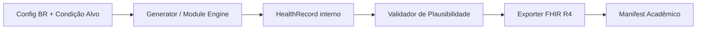
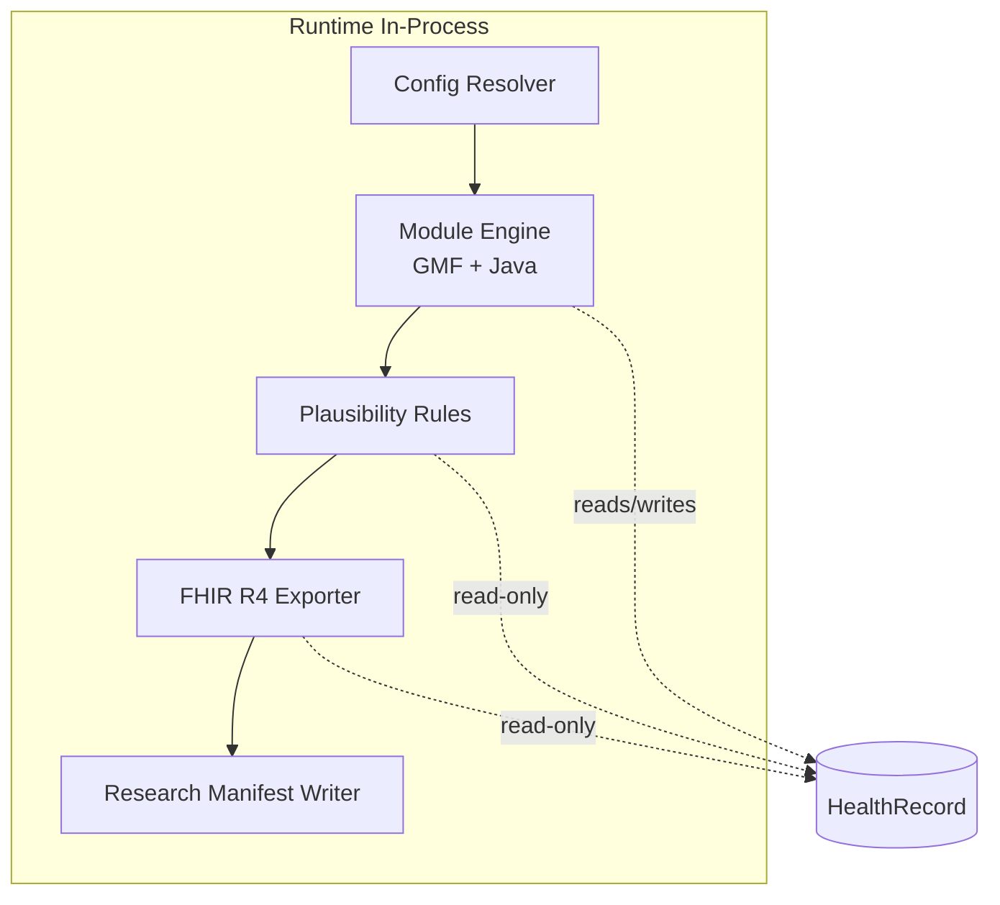
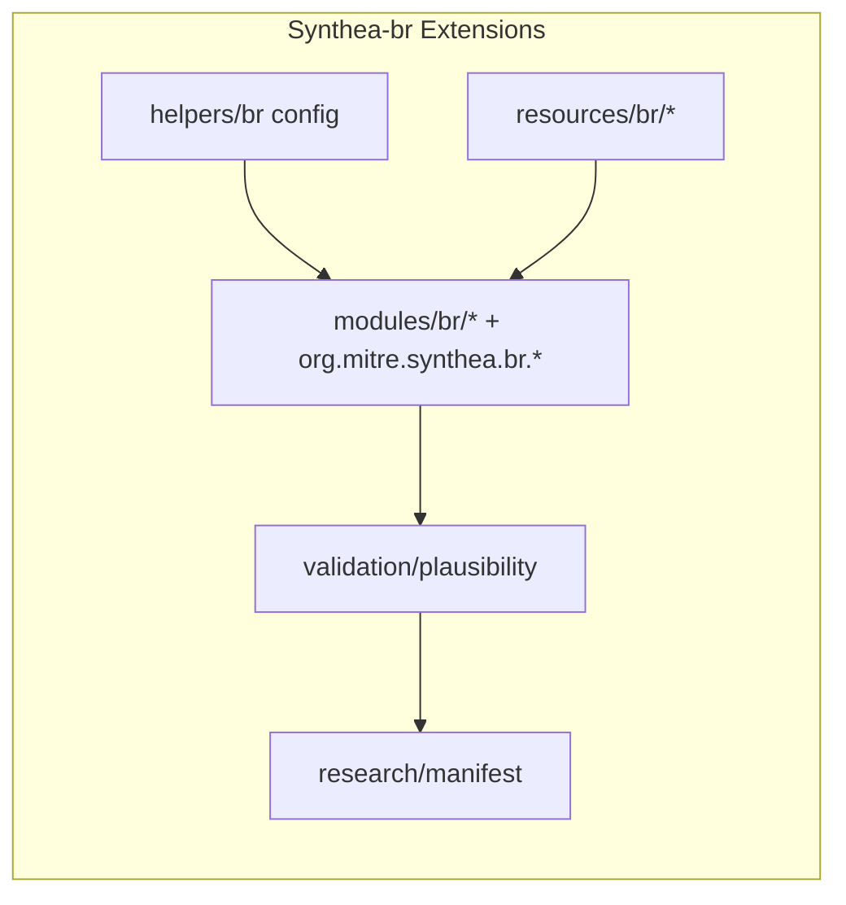

# Architecture Spine — Synthea-br

## Design Paradigm

O `Synthea-br` segue **Modular Monolith + Pipes-and-Filters (in-process)**:
- monólito Java único (mesmo runtime do Synthea), sem sidecar no MVP;
- pipeline explícito de geração: `config -> generation -> plausibility validation -> export -> research manifest`;
- extensão por módulos GMF/resources/properties para preservar rebase com upstream.



## Invariants & Rules

### AD-1 — Boundary In-Process

- **Binds:** FR-1, FR-2, FR-4, FR-5, FR-7, FR-8, FR-9, FR-10, FR-15, FR-16
- **Prevents:** dividir core e validação em serviços separados com contratos instáveis no MVP
- **Rule:** toda execução do `Synthea-br` ocorre em processo Java único; pipeline de IA opcional (ADR-007) roda in-process após geração quando `br.ai.enrichment.enabled=true`.

### AD-2 — Ownership de Mutação Clínica

- **Binds:** FR-1, FR-2, FR-8, FR-9
- **Prevents:** exportador alterando estado clínico e criando divergência não rastreável
- **Rule:** somente engine/módulos (GMF ou Java) podem mutar `person.record`; camada de validação e exportação é read-only sobre `HealthRecord`.

### AD-3 — Localização BR por Data Packs

- **Binds:** FR-4, FR-5, FR-6, FR-7
- **Prevents:** regras BR hardcoded no Java espalhadas em múltiplos pacotes
- **Rule:** contexto brasileiro é fornecido por data packs versionados (`resources/br/*`) + mapping explícito; código Java referencia dados por chave/config, não por literais clínicos.

### AD-4 — Cohort Direcionada por Gate de Condição

- **Binds:** FR-1, FR-2
- **Prevents:** geração de cohort com mistura silenciosa de pacientes fora da condição alvo
- **Rule:** execução com `target_condition` ativa deve aplicar gate final que valida presença da condição alvo no paciente; pacientes não conformes são excluídos ou falham execução conforme modo configurado.

### AD-5 — Plausibility Engine Determinístico

- **Binds:** FR-8, FR-9, FR-10, SM-2
- **Prevents:** validação subjetiva sem repetibilidade acadêmica
- **Rule:** regras de plausibilidade têm IDs estáveis, severidade e saída estruturada; para mesma seed/config/regra, relatório deve ser determinístico.

### AD-6 — Proveniência Acadêmica Obrigatória

- **Binds:** FR-11, FR-12, FR-13, FR-14, SM-3, SM-4, SM-6
- **Prevents:** resultados não reproduzíveis e impossível rastrear paper para execução real
- **Rule:** cada run destinado a pesquisa gera manifest com hash de config, seed, commit e checksum de output; ausência de manifest invalida run para uso acadêmico oficial.

### AD-7 — Compatibilidade Upstream First

- **Binds:** FR-10, FR-15, FR-16, constraints de rebase
- **Prevents:** fork inviável de rebasing por acoplamento excessivo no core
- **Rule:** customizações novas devem viver em `org.mitre.synthea.br.*` e `resources/br/*` sempre que possível; alterações no core upstream exigem ADR explícito e justificativa de não-extensibilidade.

### AD-8 — FHIR R4 como Contrato Externo Primário

- **Binds:** FR-15, FR-16
- **Prevents:** suporte parcial quebrando interoperabilidade esperada para pesquisa
- **Rule:** MVP garante consistência no caminho R4; qualquer mudança de modelo interno deve manter export/validação R4 passando `./gradlew check`.



## Consistency Conventions

| Concern | Convention |
| --- | --- |
| Naming (entities, files, interfaces, events) | Prefixo funcional `br.*` para propriedades; pacotes de extensão em `org.mitre.synthea.br.*`; regras de plausibilidade com ID `PLAUS-###`. |
| Data & formats (ids, dates, error shapes, envelopes) | Manifest em JSON com campos fixos (`seed`, `config_hash`, `commit_sha`, `output_checksum`, `generated_at_iso8601`); datas em ISO-8601 UTC. |
| State & cross-cutting (mutation, errors, logging, config, auth) | Mutação só no engine/módulos; validação/export read-only; erro de condição alvo sem match gera exit code não-zero; logs estruturados para anexar em `docs/research/experiments/`. |

## Stack

| Name | Version |
| --- | --- |
| Java | 17 |
| Gradle | 9.2.1 |
| Synthea core | 4.0.1-SNAPSHOT (fork `Synthea-br`) |
| HAPI FHIR (R4 path) | 6.1.0 |
| Gson | 2.9.0 |
| SnakeYAML | 1.33 |
| Checkstyle | 8.4 |
| JUnit | 4.13.2 |

## Structural Seed



```text
src/
  main/
    java/
      org/mitre/synthea/
        br/                     # extensões Synthea-br (config, validação, manifest)
        modules/                # módulos Java existentes + ponte para módulos BR
        export/                 # exportadores existentes; R4 preservado
    resources/
      br/
        demographics/           # distribuições BR (IBGE subset)
        geography/              # estados/municípios BR
        coding/                 # mappings CID-10 piloto
      modules/
        br/                     # módulos GMF de condição alvo
docs/
  research/
    experiments/               # template e execuções acadêmicas
    adr/                       # ADRs (inclui decisão sobre IA e rebase)
```

## Capability → Architecture Map

| Capability / Area | Lives in | Governed by |
| --- | --- | --- |
| Cohort direcionada por condição | `modules/br/*`, gate de condição no runtime | AD-1, AD-2, AD-4 |
| Localização BR (demografia/geografia/providers/códigos) | `resources/br/*`, loaders `org.mitre.synthea.br.*` | AD-3, AD-7 |
| Plausibilidade clínica | `org.mitre.synthea.br.validation.*` + regras versionadas | AD-2, AD-5 |
| Workflow acadêmico e reproducibilidade | `docs/research/*`, writer de manifest | AD-6 |
| Export FHIR R4 com proveniência | `export/*` + sidecar/metadados | AD-2, AD-8 |

## Deferred

- Fonte oficial de tabelas CID-10 BR (DATASUS/WHO/subset curado) — ADR pendente antes da expansão de FR-6 além do piloto.
- Frequência exata de rebase com upstream (`semanal`, `por release`, `por fase`) — ADR de manutenção na Fase 0.
- Modelo de monetização futura (open-core, SaaS, consultoria) — fora do MVP; novo PRD de produto.
- Pipeline IA operacional (pós-processamento ou híbrido) — somente após spike documental e infra disponível.
