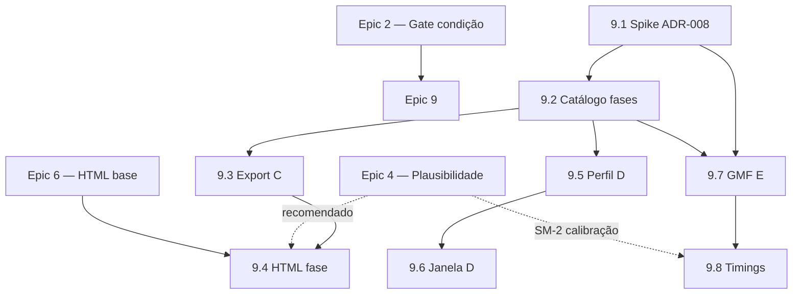

---
stepsCompleted:
  - step-01-validate-prerequisites
  - step-02-design-epics
  - step-03-create-stories
  - step-04-final-validation
inputDocuments:
  - _bmad-output/planning-artifacts/prds/prd-synthea-2026-06-29/prd.md
  - _bmad-output/planning-artifacts/architecture/architecture-synthea-2026-06-30/ARCHITECTURE-SPINE.md
---

# Synthea-br - Epic Breakdown

## Overview

Este documento contém o detalhamento completo de épicos e histórias para o Synthea-br, decompondo os requisitos do PRD e da Arquitetura em histórias implementáveis organizadas por valor entregue ao usuário.

## Requirements Inventory

### Functional Requirements

FR1: Especificar condição clínica alvo (nome/ID de módulo GMF) via configuração ou CLI antes da geração.
FR2: Gerar cohort com condição garantida (default 100%), com comportamento determinístico para mesma seed/config.
FR3: Compor múltiplas condições (AND/OR) em versão futura (não-MVP).
FR4: Aplicar perfil demográfico brasileiro quando perfil `br` estiver ativo.
FR5: Gerar geografia brasileira consistente (UF/endereço/coordenadas).
FR6: Suportar nomenclatura clínica brasileira (subset CID-10 no MVP).
FR7: Atribuir encounters a providers do dataset brasileiro.
FR8: Manter catálogo versionado de regras de plausibilidade com IDs estáveis.
FR9: Gerar relatório de validação pós-geração com severidade e agregados.
FR10: Executar spike documental de IA vs regras puras e publicar ADR com decisão.
FR11: Fornecer template de experimento reprodutível para pesquisa.
FR12: Registrar decisões relevantes em ADRs numerados.
FR13: Gerar manifest de rastreabilidade (seed, config hash, commit, checksum).
FR14: Disponibilizar guia acadêmico PT-BR para contribuição e uso ético.
FR15: Preservar exportação FHIR R4 funcional para cohorts direcionadas.
FR16: Incluir metadados de proveniência (Synthea-br, perfil, condição, versão) no output.
FR17: Export HTML narrativo da cohort (Cohort Narrative Viewer).
FR18: Documentar e selecionar referências de trajetórias longitudinais (OncoSynth, Coogee, linhas SUS/DATASUS) para ancoragem clínica.
FR19: Manter catálogo versionado de fases de trajetória clínica por condição-alvo (allowlists de códigos e ordem canônica).
FR20: Exportar cohort em modo focado na trajetória clínica (CSV/FHIR/HTML) sem poluição de eventos irrelevantes.
FR21: Renderizar narrativa HTML agrupada por fase clínica (modo orientador) alinhada à condição-alvo.
FR22: Aplicar perfil de geração enxuto que suprime módulos não essenciais quando `br.target_condition` está ativo.
FR23: Restringir janela temporal de simulação à época relevante da trajetória (pré/diagnóstico/tratamento/seguimento).
FR24: Oferecer módulo GMF de trajetória oncológica episódica como alternativa à simulação de vida inteira para cohort direcionada.
FR25: Calibrar timings e transições entre fases a partir de estatísticas derivadas de referências externas (formato importável, sem PHI).

### NonFunctional Requirements

NFR1: Reprodutibilidade obrigatória: seed+config devem gerar output equivalente.
NFR2: Performance alvo MVP: geração de 500 pacientes em até 30 min (máquina lab 16GB, assumido).
NFR3: Manutenibilidade: extensão deve respeitar convenções de `project-context.md`.
NFR4: Observabilidade: logs e artefatos devem suportar auditoria acadêmica.
NFR5: Privacidade/ética: somente dados sintéticos; proibido PHI no repositório.
NFR6: Compatibilidade upstream: arquitetura deve permitir rebase periódico com `synthetichealth/synthea`.
NFR7: Qualidade clínica: atingir maior rigor viável (SM-2: 0% alta, <=2% média).
NFR8: Interoperabilidade: caminho FHIR R4 deve continuar validável via suíte existente.
NFR9: Determinismo da validação: mesmas regras/seed/config produzem relatório consistente.
NFR10: Documentação publicável: materiais devem sustentar submissão em SBIS/CBIS.

### Additional Requirements

- Paradigma arquitetural fixado: Modular Monolith + Pipes-and-Filters in-process (sem sidecar no MVP).
- Mutação clínica somente no engine/módulos; validação/export read-only sobre `HealthRecord`.
- Localização BR via data packs (`resources/br/*`) e extensões em `org.mitre.synthea.br.*`.
- Gate de condição alvo obrigatório para evitar pacientes não conformes na cohort direcionada.
- Engine de plausibilidade com IDs estáveis (`PLAUS-###`) e saída estruturada.
- Manifest acadêmico obrigatório por execução oficial de pesquisa.
- Regra upstream-first: alterações no core exigem ADR explícito; preferir extensão isolada.
- FHIR R4 é contrato externo primário no MVP.
- Deferred técnicos: fonte oficial CID-10 BR, frequência de rebase, modelo de monetização futura, IA operacional.
- Epic 9 (trajetória clínica focada): três abordagens complementares — **C** filtro de export, **D** geração enxuta, **E** módulo GMF episódico; ancoragem documental em OncoSynth, Coogee e linhas SUS/DATASUS (sem integrar ML/LLM como motor primário no MVP do épico).
- Modo trajetória focada preserva `HealthRecord` completo na geração; filtragem de export é read-only (AD-2). Módulo episódico (E) muta via GMF conforme AD-2/AD-4.

### UX Design Requirements

Nenhum contrato UX encontrado para este ciclo (DESIGN.md/EXPERIENCE.md ausentes).

### FR Coverage Map

FR1: Epic 2 — Especificar condição clínica alvo via config/CLI
FR2: Epic 2 — Gerar cohort com condição garantida e gate de validação
FR3: Não-MVP — Múltiplas condições AND/OR (v2)
FR4: Epic 3 — Perfil demográfico BR (distribuições IBGE)
FR5: Epic 3 — Geografia BR (UF, endereços, coordenadas)
FR6: Epic 3 — Nomenclatura CID-10 subset piloto
FR7: Epic 3 — Providers do contexto assistencial BR
FR8: Epic 4 — Catálogo versionado de regras de plausibilidade
FR9: Epic 4 — Relatório de validação pós-geração com severidade
FR10: Epic 1 — Spike documental IA vs regras puras + ADR
FR11: Epic 1 — Template de experimento reprodutível
FR12: Epic 1 — ADRs numerados de decisões significativas
FR13: Epic 1 — Manifest de rastreabilidade (seed/hash/commit/checksum)
FR14: Epic 1 — Guia acadêmico PT-BR com disclaimer ético
FR15: Epic 5 — Export FHIR R4 preservado para cohorts direcionadas
FR16: Epic 5 — Metadados de proveniência no export
FR17: Epic 6 — Export HTML narrativo da cohort (Cohort Narrative Viewer)
FR18: Epic 9 — Spike e ADR de referências de trajetória longitudinal
FR19: Epic 9 — Catálogo de fases de trajetória clínica (data pack)
FR20: Epic 9 — Export focado em trajetória (abordagem C)
FR21: Epic 9 — HTML narrativo por fase / modo orientador (abordagem C)
FR22: Epic 9 — Perfil de geração enxuto (abordagem D)
FR23: Epic 9 — Janela temporal de simulação (abordagem D)
FR24: Epic 9 — Módulo GMF de trajetória episódica (abordagem E)
FR25: Epic 9 — Calibração de timings a partir de referências externas

## Epic List

### Epic 1: Infraestrutura Acadêmica e Rastreabilidade
Pesquisadores e estudantes conseguem documentar, rastrear e reproduzir experimentos antes mesmo de gerar qualquer cohort. Toda execução oficial produz evidência citável (manifest, ADR, template de experimento).
**FRs cobertos:** FR10, FR11, FR12, FR13, FR14

### Epic 2: Geração de Cohort Direcionada por Condição Clínica
Pesquisadores especificam uma condição clínica (ex.: câncer de mama) e obtêm uma população sintética onde 100% dos pacientes satisfazem a condição — com reprodutibilidade garantida por seed e gate de validação.
**FRs cobertos:** FR1, FR2

### Epic 3: Contexto Demográfico e Assistencial Brasileiro
Pesquisadores geram pacientes com perfil brasileiro autêntico: demografia IBGE, endereços e UFs válidos, nomenclatura clínica BR (CID-10 subset piloto) e providers do contexto assistencial nacional.
**FRs cobertos:** FR4, FR5, FR6, FR7

### Epic 4: Validação e Auditoria de Plausibilidade Clínica
Pesquisadores auditam a qualidade clínica dos dados gerados: catálogo de regras versionadas com IDs estáveis (PLAUS-###), relatório automatizado com severidade (0% alta, ≤2% média) e saída determinística para publicação.
**FRs cobertos:** FR8, FR9

### Epic 5: Export FHIR R4 com Proveniência Publicável
Pesquisadores exportam datasets em FHIR R4 com metadados de proveniência (fork Synthea-br, perfil, condição, versão) que permitem citação direta em artigos e conferências.
**FRs cobertos:** FR15, FR16

### Epic 6: Visualizador Narrativo HTML da Cohort
Pesquisadores validam casos clínicos com orientadores via HTML estático offline — timeline e seções aninhadas por paciente, complementando FHIR/CSV.
**FRs cobertos:** FR17

### Epic 8: Enriquecimento Clínico por IA (MAI-DxO)
Pesquisadores enriquecem cohorts opcionalmente com painel de personas clínicas (BYOK), resumos narrativos PT-BR no HTML e salvaguardas de robustez/viés — **complementar** ao motor determinístico, nunca substituto.
**Origem:** ADR-007 (implementação core já presente no código)
**Depende de:** Epic 6 (HTML + seção IA)
**Não depende de:** Epic 9 — camada IA permanece opcional

### Epic 9: Trajetória Clínica Focada (Cohort Enxuta)
Pesquisadores obtêm cohorts de condição-alvo **enxutas e narrativamente coerentes** — rastreio, diagnóstico, estadiamento, tratamento e seguimento — ancoradas em referências de trajetórias longitudinais (OncoSynth, Coogee, linhas SUS/DATASUS), via filtro de export (C), geração enxuta (D) e módulo GMF episódico (E).
**FRs cobertos:** FR18, FR19, FR20, FR21, FR22, FR23, FR24, FR25
**Depende de:** Epic 2 (condição garantida), Epic 4 (plausibilidade — recomendado antes de 9.4+), Epic 6 (HTML base — para 9.4)
**Não depende de:** Epic 8 (MAI-DxO) — camada IA permanece opcional e complementar

## Epic 1: Infraestrutura Acadêmica e Rastreabilidade

Pesquisadores e estudantes conseguem documentar, rastrear e reproduzir experimentos antes mesmo de gerar qualquer cohort. Toda execução oficial produz evidência citável.

### Story 1.1: Spike de Viabilidade IA vs Regras Puras

Como pesquisador do grupo,
quero um ADR que avalie se a plausibilidade alvo (SM-2) é atingível somente com módulos/regras,
para que a equipe saiba se IA será necessária em fases futuras sem GPU ou API.

**Acceptance Criteria:**

**Given** o repositório Synthea-br existe com `docs/research/adr/` configurado
**When** o pesquisador conclui o spike documental (revisão bibliográfica + análise comparativa)
**Then** um ADR numerado é publicado com métricas de regras puras, lacunas residuais e recomendação explícita (IA in/out/futuro)
**And** o ADR segue formato contexto/decisão/consequências
**And** o spike não depende de GPU, API paga ou treinamento local

### Story 1.2: Template de Experimento Reprodutível

Como estudante ou pesquisador,
quero um template padronizado para documentar experimentos,
para que qualquer membro do grupo reproduza e cite o experimento em artigos.

**Acceptance Criteria:**

**Given** o repositório está clonado localmente
**When** o usuário acessa `docs/research/experiments/`
**Then** existe `experiment-template.md` com campos: hipótese, config, seed, comando, data, resultados, conclusão, refs FR/SM
**And** existe pelo menos um experimento piloto preenchido seguindo o template
**And** o template está versionado no repositório

### Story 1.3: Registro de Decisões Arquiteturais (ADRs)

Como membro do grupo de pesquisa,
quero convenção e estrutura de ADRs no repositório,
para que decisões significativas sejam consultáveis por orientandos novos.

**Acceptance Criteria:**

**Given** o repositório Synthea-br está configurado
**When** um membro registra uma decisão significativa
**Then** o ADR é criado em `docs/research/adr/ADR-NNN-<titulo>.md`
**And** o formato inclui contexto, decisão e consequências
**And** existe `docs/research/adr/README.md` listando ADRs com status

### Story 1.4: Manifest de Rastreabilidade de Execução

Como pesquisador,
quero que cada run de geração produza um manifest JSON com seed, config hash, commit e checksum,
para reproduzir a execução exata na seção Methods do artigo.

**Acceptance Criteria:**

**Given** o fork Synthea-br está instalado
**When** o pesquisador executa uma geração com perfil de pesquisa ativo
**Then** um `manifest.json` é gerado com: `seed`, `config_hash`, `commit_sha`, `output_checksum`, `generated_at_iso8601`
**And** reexecução com mesmo manifest produz checksum idêntico (NFR1, SM-3)
**And** ausência de manifest invalida o run para uso acadêmico oficial (documentado no guia)

### Story 1.5: Guia Acadêmico de Contribuição PT-BR

Como estudante iniciando no projeto,
quero um guia em português sobre execução, documentação e uso ético,
para contribuir sem depender de suporte oral do orientador.

**Acceptance Criteria:**

**Given** o estudante clonou o repositório
**When** acessa `docs/CONTRIBUTING-ACADEMICO.md`
**Then** o guia contém: instalação/execução, documentação de experimento, citação do fork e disclaimer de dados sintéticos
**And** o guia está em Português do Brasil
**And** a seção Methods de um rascunho pode ser preenchida a partir do template + manifest (SM-6)

---

## Epic 2: Geração de Cohort Direcionada por Condição Clínica

Pesquisadores especificam condição clínica e obtêm cohort onde 100% dos pacientes satisfazem a condição alvo.

### Story 2.1: Configuração de Condição Clínica Alvo

Como pesquisador,
quero declarar a condição clínica alvo via `synthea.properties` ou flag CLI,
para direcionar a geração sem editar código Java.

**Acceptance Criteria:**

**Given** o Synthea-br está instalado
**When** o pesquisador define `br.target_condition=breast_cancer` (config ou CLI `-Dbr.target_condition=...`)
**Then** o sistema carrega a condição e valida que o módulo GMF correspondente existe
**And** condição inexistente retorna erro identificável com mensagem clara
**And** a documentação lista condições suportadas no MVP (mínimo: câncer de mama)
**And** implementação reside em `org.mitre.synthea.br.*` (AD-7)

### Story 2.2: Módulo GMF Câncer de Mama (Piloto)

Como pesquisador,
quero um módulo GMF de câncer de mama em `resources/modules/br/`,
para que a simulação produza trajetória clínica compatível com a condição piloto.

**Acceptance Criteria:**

**Given** o módulo está registrado e compatível com GMF 2.0
**When** a geração roda com `br.target_condition=breast_cancer` e seed fixo
**Then** pacientes gerados apresentam condição verificável no `HealthRecord`
**And** states do módulo são clonados por paciente — master module nunca mutado (AD-2)
**And** testes com seed fixo passam em `./gradlew check`

### Story 2.3: Gate de Cohort com Condição Garantida

Como pesquisador,
quero que 100% da cohort apresente a condição alvo ao final da simulação,
para usar os dados em estudos estatísticos sem filtragem manual.

**Acceptance Criteria:**

**Given** `br.target_condition` está ativo e percentual default é 100%
**When** o pesquisador gera cohort de n=500 com seed fixo
**Then** 100% dos pacientes exportados apresentam condição alvo verificável (SM-1)
**And** pacientes não conformes são excluídos ou a execução falha com erro claro (modo configurável)
**And** mesma seed + config produz percentual idêntico (NFR1)
**And** gate implementado sem mutar exportadores — apenas engine/módulos escrevem em `HealthRecord` (AD-2, AD-4)

---

## Epic 3: Contexto Demográfico e Assistencial Brasileiro

Pesquisadores geram pacientes com perfil brasileiro autêntico via data packs versionados.

### Story 3.1: Perfil Demográfico Brasileiro (IBGE)

Como pesquisador,
quero ativar perfil `br` com distribuições demográficas brasileiras,
para que a cohort reflita contexto epidemiológico nacional.

**Acceptance Criteria:**

**Given** data pack em `src/main/resources/br/demographics/` com distribuições IBGE simplificadas
**When** o pesquisador ativa `br.profile=br` via properties ou CLI
**Then** amostra N≥1000 apresenta distribuição etária/sexo mais próxima da referência BR documentada que do default EUA
**And** dados demográficos são carregados de resources — não hardcoded no Java (AD-3)
**And** perfil desativado mantém comportamento upstream inalterado

### Story 3.2: Geografia Brasileira

Como pesquisador,
quero endereços e localização consistentes com divisão administrativa brasileira,
para análises geográficas válidas no contexto nacional.

**Acceptance Criteria:**

**Given** data pack em `src/main/resources/br/geography/` com UFs e municípios piloto
**When** perfil `br` está ativo
**Then** 100% dos endereços usam UF válida e formato postal BR
**And** coordenadas geradas caem dentro do estado declarado
**And** nenhum endereço EUA aparece com perfil `br` ativo

### Story 3.3: Nomenclatura Clínica BR (CID-10 Subset Piloto)

Como pesquisador,
quero códigos CID-10 brasileiros para a condição piloto no export FHIR,
para interoperabilidade com terminologia nacional.

**Acceptance Criteria:**

**Given** mapping EU→BR documentado em `src/main/resources/br/coding/` para câncer de mama
**When** perfil `br` está ativo e condição piloto é gerada
**Then** condições no export FHIR referenciam sistemas/códigos documentados na config BR
**And** fonte do subset está documentada no ADR (fonte oficial CID-10 TBD — subset piloto aceito para MVP)
**And** TUSS/SUS billing permanece fora do escopo

### Story 3.4: Providers do Contexto Assistencial BR

Como pesquisador,
quero encounters atribuídos a providers brasileiros,
para simular contexto assistencial nacional realista.

**Acceptance Criteria:**

**Given** dataset CSV em `src/main/resources/br/providers/` (UBS/hospital genérico)
**When** perfil `br` está ativo
**Then** providers referenciados nos exports pertencem ao dataset BR
**And** nenhum provider default EUA aparece com perfil `br` ativo
**And** loaders residem em `org.mitre.synthea.br.*` (AD-3, AD-7)

---

## Epic 4: Validação e Auditoria de Plausibilidade Clínica

Pesquisadores auditam qualidade clínica com regras versionadas e relatório determinístico.

### Story 4.1: Catálogo de Regras de Plausibilidade

Como pesquisador,
quero um catálogo versionado de regras de coerência clínica com IDs estáveis,
para definir e evoluir critérios de qualidade de forma rastreável.

**Acceptance Criteria:**

**Given** o repositório Synthea-br está configurado
**When** o grupo adiciona regras em formato JSON/YAML versionado
**Then** cada regra possui ID estável no formato `PLAUS-###` com severidade (alta/média/baixa)
**And** regras piloto para câncer de mama cobrem pelo menos: sequência temporal de exames, compatibilidade de medicamentos, presença de diagnóstico
**And** catálogo reside em `src/main/resources/br/plausibility/` ou equivalente documentado

### Story 4.2: Relatório de Validação Pós-Geração

Como orientador,
quero executar relatório automatizado de plausibilidade após a geração,
para aprovar ou rejeitar datasets antes de submissão acadêmica.

**Acceptance Criteria:**

**Given** cohort gerada com regras piloto carregadas
**When** o pesquisador executa validação via comando documentado (`./gradlew` task ou CLI)
**Then** relatório estruturado lista violações por paciente e agregados (% por severidade)
**And** mesma seed/config/regras produzem relatório idêntico (NFR9, AD-5)
**And** validação é read-only sobre `HealthRecord` — não muta estado clínico (AD-2)
**And** cohort piloto atinge SM-2: 0% violações alta, ≤2% média (após calibração de regras)

---

## Epic 5: Export FHIR R4 com Proveniência Publicável

Pesquisadores exportam datasets FHIR R4 com metadados citáveis para publicação.

### Story 5.1: Preservar Export FHIR R4 para Cohorts Direcionadas

Como pesquisador,
quero exportação FHIR R4 funcional para cohorts com condição alvo e perfil BR,
para interoperabilidade com ferramentas de análise FHIR.

**Acceptance Criteria:**

**Given** cohort gerada com `br.target_condition` e perfil `br` ativos
**When** exportação FHIR R4 é executada
**Then** `./gradlew check` passa incluindo testes de exportação R4 adaptados
**And** amostra piloto passa validação HAPI existente no projeto (NFR8)
**And** exportadores permanecem read-only sobre `HealthRecord` (AD-2, AD-8)

### Story 5.2: Metadados de Proveniência no Export

Como pesquisador preparando submissão a SBIS/CBIS,
quero metadados de proveniência no Bundle FHIR ou sidecar JSON,
para citar o fork, perfil, condição e versão no artigo.

**Acceptance Criteria:**

**Given** exportação FHIR R4 concluída
**When** o pesquisador inspeciona o output
**Then** metadados identificam: `Synthea-br`, perfil geográfico (`br`), condição alvo, versão do fork e commit git
**And** campos estáveis estão documentados para citação em paper
**And** metadados são gerados automaticamente ou via script integrado ao pipeline de export
**And** sidecar JSON segue convenção de manifest (AD-6) quando aplicável

---

## Epic 6: Visualizador Narrativo HTML da Cohort

Pesquisadores validam casos clínicos sintéticos com orientadores via HTML estático offline — narrativa por paciente com timeline e seções aninhadas, complementando FHIR/CSV sem join manual de planilhas.

**Origem:** SPEC `spec-cohort-narrative-viewer` (brainstorm export-html-narrativa-clinica 2026-07-01)

### Story 6.1: Cohort Narrative Viewer — Export HTML MVP

Como pesquisador ou estudante,
quero gerar um `index.html` narrativo por cohort via flag `exporter.html.export=true`,
para apresentar casos ao orientador com timeline e seções clínicas estruturadas sem cruzar CSVs.

**Acceptance Criteria:**

**Given** o Synthea-br está instalado e Epic 2/3 implementados (cohort direcionada + perfil BR)
**When** o pesquisador define `exporter.html.export=true` e gera cohort n=10
**Then** `output/html/index.html` é produzido, válido HTML5, abrível offline no browser
**And** flag `false` ou ausente não gera pasta/arquivo HTML

**Given** `index.html` gerado
**When** o pesquisador abre a página
**Then** cada paciente aparece como accordion colapsável com cabeçalho de triagem: idade, sexo, condição principal, último evento

**Given** accordion expandido
**When** o pesquisador percorre o conteúdo
**Then** timeline cronológica contém ≥1 evento por paciente
**And** seções aninhadas presentes e populadas quando dados existem: demografia, condições, medicamentos, exames, procedimentos, encounters, cobertura

**Given** perfil `br` ativo
**When** condições piloto são exibidas
**Then** labels de seção/UI estão em PT-BR e CID-10 BR quando mapping disponível (Story 3.3)

**Given** exportadores existentes
**When** HTML export roda
**Then** implementação é read-only sobre `HealthRecord` (AD-2) e usa FreeMarker em `resources/templates/html/` (padrão CCDA)
**And** `./gradlew check` passa incluindo testes novos de `HtmlExporter`

---

## Epic 8: Enriquecimento Clínico por IA (MAI-DxO)

Pesquisadores enriquecem cohorts **opcionalmente** com orquestração MAI-DxO (ADR-007): cinco personas clínicas + Gatekeeper corrigem inconsistências pós-geração; resumos narrativos alimentam o HTML do Epic 6. O núcleo (`AiEnrichmentService`, `MaiDxoOrchestrator`) já está implementado; este épico formaliza hardening e extensões inspiradas em literatura recente (NHS England arXiv 2606.26879v2 — ver ADR-008 Adendo A).

**Fora de escopo:** LLM como motor primário de trajetória (Epic 9 / ADR-008); treinamento de modelos; API keys institucionais.

### Story 8.1: Robustez de Parsing LLM no Pipeline MAI-DxO

Como pesquisador BYOK,
quero recuperação previsível de respostas LLM malformadas ou truncadas,
para não perder turnos de persona silenciosamente.

**Acceptance Criteria:**

**Given** resposta LLM inválida como JSON
**When** parsing falha após extração regex
**Then** fallback LLM de limpeza é tentado (N tentativas configurável) antes de skip do turno

**Given** resposta truncada (padrões conhecidos)
**When** guard detecta truncamento
**Then** chamada de continuação concatena saída antes do parse

**Given** enriquecimento completo
**When** log é inspecionado
**Then** contadores `json_parse_retries`, `truncation_continuations`, `persona_turns_skipped` presentes

**Dependências:** ADR-007. **Bloqueia:** 8.2.

### Story 8.2: Personas de Estilo Narrativo e Teste de Viés Demográfico

Como pesquisador apresentando cohort enriquecida,
quero variação realista de estilo nos resumos HTML e teste opt-in de viés demográfico,
para narrativas credíveis sem amplificar preconceitos.

**Acceptance Criteria:**

**Given** enriquecimento IA ativo
**When** `AiNarrativeSummarizer` gera resumo
**Then** personas de escrita (`concise`, `narrative`, `bullet_points`, `clinical_shorthand`, `abcde`) alteram estilo sem mutar `HealthRecord`

**Given** `br.ai.narrative.persona_mode=deterministic`
**When** mesma seed e patientId
**Then** mesma persona de escrita atribuída

**Given** `br.ai.bias_test.enabled=true`
**When** teste executa
**Then** gera pares baseline/swap (sexo; extensão raça/UF) e `bias_report.json` agregado sem PHI

**Dependências:** ADR-007, Story 8.1, Epic 6. **Complementa:** Epic 9 Story 9.4 (narrativa por fase).

---

## Epic 9: Trajetória Clínica Focada (Cohort Enxuta)

Pesquisadores deixam de receber prontuários de **vida inteira** poluídos por comorbidades e consultas de rotina quando pedem uma cohort de câncer de mama. O épico entrega trajetórias **ancoradas em referências longitudinais** documentadas (OncoSynth para modelagem estatística de cohorts oncológicas; Coogee para padrões de auditoria/consistência narrativa; linhas de cuidado SUS/DATASUS para ordem e fases assistenciais), implementadas em três camadas:

| Abordagem | Escopo | Onde atua |
|-----------|--------|-----------|
| **C — Filtro de export** | Dataset e HTML enxutos a partir do `HealthRecord` completo | `org.mitre.synthea.br.pathway` + exportadores (read-only, AD-2) |
| **D — Geração enxuta** | Menos ruído **na origem** (módulos suprimidos, janela temporal) | `Generator` + config `br.generation.*` (ADR obrigatório para janela) |
| **E — Módulo GMF episódico** | Trajetória oncológica como simulação principal, não subproduto de vida inteira | `resources/modules/br/` + gate Epic 2 |

**Fora de escopo do Epic 9 (MVP):** substituir o `Generator` por OncoSynth/Coogee como motor primário; treinar modelos de difusão; pipeline LLM não-determinístico como única fonte de coerência (conflita com NFR1/ADR-001). Integrações ML/LLM futuras exigem ADR próprio pós-calibração SM-2.

**Sequenciamento recomendado:** 9.1 → 9.2 → (9.3 ∥ 9.5) → 9.4 → 9.6 → 9.7 → 9.8

### Story 9.1: Spike — Referências de Trajetória Longitudinal + ADR-008

Como pesquisador líder,
quero um spike documental que compare OncoSynth, Coogee e linhas de cuidado SUS/DATASUS como **fontes de ancoragem** (fases, ordem, timings),
para decidir o que importar como data pack determinístico vs o que permanece referência bibliográfica.

**Acceptance Criteria:**

**Given** Epic 1 (processo de ADR) concluído
**When** o spike analisa as três famílias de referência
**Then** `docs/research/adr/ADR-008-trajetoria-clinica-focada.md` é publicado com: contexto, decisão (C+D+E complementares), consequências e matriz o que entra no fork vs deferred
**And** o documento mapeia para câncer de mama piloto: fases assistenciais (rastreio → diagnóstico → estadiamento → tratamento → seguimento), com citações e limitações (ex.: OncoSynth = estatística de sobrevida/tratamento, não prontuário FHIR; Coogee = padrão de auditoria narrativa; DATASUS/SUS = ordem macro de procedimentos)
**And** o spike **não** exige GPU, API paga nem commit de datasets com PHI
**And** define formato-alvo de importação para Story 9.8 (ex.: JSON de priors temporais por fase, sem dados de paciente real)

**Dependências:** Epic 1 (Story 1.3). **Bloqueia:** 9.2, 9.5, 9.7, 9.8.

---

### Story 9.2: Catálogo de Fases de Trajetória Clínica (Data Pack)

Como pesquisador,
quero um catálogo versionado de fases da trajetória de câncer de mama com allowlists de códigos clínicos,
para que filtros, narrativa HTML e regras de plausibilidade compartilhem a mesma ontologia de “evento relevante”.

**Acceptance Criteria:**

**Given** ADR-008 aceito e módulo upstream `breast_cancer.json` disponível
**When** o catálogo é carregado de `src/main/resources/br/pathways/breast_cancer_phases.json`
**Then** cada fase possui: `phase_id` estável, título PT-BR, ordem canônica, descrição, `code_allowlist` (SNOMED/LOINC/RxNorm/CPT subset extraído do módulo piloto) e `encounter_types` opcionais
**And** fases mínimas cobrem: `screening`, `diagnosis`, `staging`, `treatment`, `follow_up` (nomes finais documentados no JSON)
**And** demografia e metadados de cohort (idade, sexo, município BR) estão marcados como `always_include` independente da fase
**And** API Java `org.mitre.synthea.br.pathway.PathwayCatalog` expõe resolução por `br.target_condition` sem hardcode de códigos no Java (AD-3)
**And** testes unitários validam parsing, ordem de fases e presença de códigos críticos (ex.: `254837009`)

**Dependências:** Story 9.1. **Bloqueia:** 9.3, 9.4, 9.7, 9.8.

---

### Story 9.3: Export Focado em Trajetória — Abordagem C

Como pesquisador,
quero ativar `br.pathway.focus` para exportar apenas eventos da trajetória clínica alvo (+ demografia),
para eliminar poluição visual em CSV/FHIR sem perder o prontuário completo na simulação.

**Acceptance Criteria:**

**Given** `br.target_condition=breast_cancer` e `br.pathway.focus=true` (CLI `--br.pathway.focus=true` ou property)
**When** a cohort é gerada e exportada (CSV e FHIR R4)
**Then** recursos exportados restringem-se a entradas cujo código/tipo está no catálogo 9.2 ou em `always_include`
**And** `br.pathway.focus=false` (default) preserva comportamento atual de export integral
**And** implementação estende o padrão `Exporter.filterForExport` em `org.mitre.synthea.br.pathway.PathwayExportFilter` — **read-only** sobre `HealthRecord` (AD-2)
**And** `manifest.json` inclui: `pathway_focus`, `pathway_catalog_version`, `pathway_condition`
**And** mesma seed + config + catálogo → mesmo output filtrado (NFR1)
**And** `./gradlew check` inclui testes com fixture `Person` manual contendo eventos in/out da allowlist

**Dependências:** Story 9.2, Epic 2, Epic 5 (Story 5.1 recomendado). **Bloqueia:** 9.4.

---

### Story 9.4: HTML Narrativo por Fase — Modo Orientador (Abordagem C)

Como estudante apresentando cohort ao orientador,
quero timeline agrupada por **fase clínica** e modo “orientador” que oculta ruído residual,
para que a narrativa pareça seguir rastreio → diagnóstico → tratamento → seguimento.

**Acceptance Criteria:**

**Given** Story 9.3 implementada e `exporter.html.export=true`
**When** `exporter.html.pathway_mode=orientador` (default quando `br.pathway.focus=true`; valores: `orientador`, `pesquisador`, `full`)
**Then** cada paciente exibe timeline **agrupada por fase** na ordem canônica do catálogo 9.2, com eventos ordenados dentro da fase
**And** modo `orientador` mostra apenas eventos da trajetória (+ demografia); modo `pesquisador` inclui seção colapsável “Fora da trajetória”; modo `full` equivale ao Epic 6
**And** condição-alvo (`breast_cancer`) possui destaque visual ao longo da timeline (complemento v1.1 do brainstorm Epic 6)
**And** labels e fases em PT-BR com perfil `br`
**And** implementação read-only em `HtmlExporter` / templates FreeMarker (AD-2)
**And** testes cobrem agrupamento por fase e ausência de eventos irrelevantes no modo orientador

**Dependências:** Story 9.3, Epic 6 (Story 6.1). **Recomendado:** Epic 4 (PLAUS-002 sequência temporal).

---

### Story 9.5: Perfil de Geração Enxuto — Abordagem D

Como pesquisador,
quero `br.generation.module_profile=pathway_minimal` quando uso condição-alvo,
para reduzir comorbidades e módulos paralelos **durante** a simulação, não só no export.

**Acceptance Criteria:**

**Given** `br.target_condition=breast_cancer` e `br.generation.module_profile=pathway_minimal`
**When** a geração executa
**Then** apenas módulos do perfil curado são carregados (mínimo documentado: lifecycle, insurance, encounters, wellness reduzido, `breast_cancer` + submódulos; **excluídos** módulos de baixa relevância oncológica piloto — dental, veteran, etc.)
**And** perfil `full` (default) mantém comportamento upstream inalterado quando `module_profile` ausente
**And** lista allow/deny versionada em `src/main/resources/br/generation/module_profiles/pathway_minimal.json`
**And** gate Epic 2 continua garantindo 100% condição-alvo (SM-1)
**And** mesma seed + config + perfil → mesma cohort (NFR1)
**And** **não** usa flag `-m` isolada sem perfil — perfil é conjunto testado e documentado
**And** `./gradlew check` inclui teste de integração: cohort minimal vs full com contagem de condições distintas inferior no minimal

**Dependências:** Story 9.1, Epic 2. **Paralelizável com:** 9.3 após 9.2. **Bloqueia:** 9.6.

---

### Story 9.6: Janela Temporal de Simulação — Abordagem D

Como pesquisador,
quero restringir a simulação a uma janela temporal relevante (`br.generation.simulation_window`),
para não simular décadas de vida irrelevantes antes do risco/onset oncológico.

**Acceptance Criteria:**

**Given** ADR-008 documenta impacto em demografia, seed e comorbidades
**When** `br.generation.simulation_window=pre_onset_years:N` está configurado (N documentado; ex.: 5–15 para mama)
**Then** a simulação inicia em `target_age - N` (ou equivalente documentado) em vez de nascimento, preservando atributos demográficos coerentes com `-a`/IBGE
**And** combinação `simulation_window` + `module_profile=pathway_minimal` reduz tempo de geração mensurável vs baseline (log de duração no manifest ou metadata)
**And** gate e plausibilidade Epic 4 continuam aplicáveis ao recorte exportado
**And** mesma seed + config → mesmo resultado (NFR1)
**And** combinações inválidas (janela incompatible com `-a`) falham com erro claro na inicialização

**Dependências:** Story 9.5, Story 9.1 (ADR). **Recomendado antes de produção:** Epic 4.

---

### Story 9.7: Módulo GMF de Trajetória Episódica — Abordagem E

Como pesquisador,
quero um módulo GMF BR (`modules/br/breast_cancer_trajectory.json`) que modele a jornada oncológica como **trajetória principal**,
para coerência clínica na origem em vez de depender só de filtragem pós-geração.

**Acceptance Criteria:**

**Given** catálogo de fases 9.2 e gate Epic 2 ativos
**When** `br.generation.trajectory_mode=episodic` e condição `breast_cancer` configurada
**Then** pacientes passam por fluxo GMF episódico alinhado às fases do catálogo (transições documentadas; compatível GMF 2.0)
**And** módulo reside em `src/main/resources/modules/br/` (ou path documentado) e integra-se ao gate existente (`254837009` verificável)
**And** states clonados por paciente — master module nunca mutado (AD-2)
**And** modo `lifespan` (default) preserva simulação upstream atual
**And** testes com seed fixo provam sequência: diagnóstico antes de procedimentos de tratamento piloto (alinhado PLAUS-001/002 quando Epic 4 existir)
**And** documentação no guia de uso descreve trade-off episódico vs vida inteira

**Dependências:** Story 9.2, Epic 2. **Recomendado:** Story 9.5 (perfil minimal como pré-requisito operacional). **Alimenta:** 9.8.

---

### Story 9.8: Calibração de Timings a Partir de Referências Externas

Como pesquisador,
quero importar **priors temporais** (intervalos entre fases) derivados de referências documentadas no ADR-008,
para que transições GMF e ordem narrativa reflitam linhas SUS/DATASUS e literatura oncológica — sem incorporar PHI.

**Acceptance Criteria:**

**Given** Story 9.1 define formato de importação e Story 9.7 implementa módulo episódico
**When** data pack `src/main/resources/br/pathways/breast_cancer_timing_priors.json` está presente (fonte citada: agregados SUS/DATASUS públicos, parâmetros inspirados em OncoSynth/Coogee **como metadado bibliográfico**, não runtime ML)
**Then** transições entre fases usam distribuições documentadas (min/max/median ou buckets) configuráveis via JSON
**And** nenhum arquivo no repositório contém PHI ou microdados de paciente real (NFR5)
**And** alteração do data pack com mesma seed altera timings de forma determinística (NFR1)
**And** `manifest.json` registra `pathway_timing_priors_version` e `pathway_reference_notes` (links/citações)
**And** experimento piloto documentado em `docs/research/experiments/` compara cohort episódica calibrada vs não calibrada (métricas: % eventos fora de ordem, SM-2 quando Epic 4 disponível)

**Dependências:** Story 9.1, Story 9.7. **Fecha:** loop de calibração com Epic 4 (revisão ADR-001 pós-SM-2 real).

---

### Dependências entre épicos (Epic 9)

### Métricas de sucesso sugeridas (Epic 9)

| ID | Métrica | Alvo piloto (câncer de mama, n=10–50) |
|----|---------|----------------------------------------|
| SM-9.1 | % eventos exportados classificados como “trajetória” no modo focus | ≥ 80% |
| SM-9.2 | Redução de linhas CSV vs export full (mesma cohort) | ≥ 50% |
| SM-9.3 | Violações PLAUS-002 (ordem temporal) com modo episódico + calibração | ≤ SM-2 média |
| SM-9.4 | Tempo de geração (minimal + window vs baseline) | redução documentada; não regredir NFR2 em n=500 |
