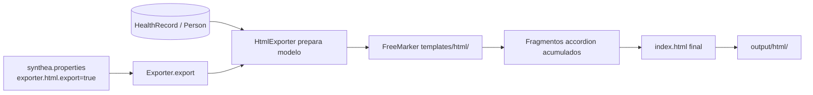
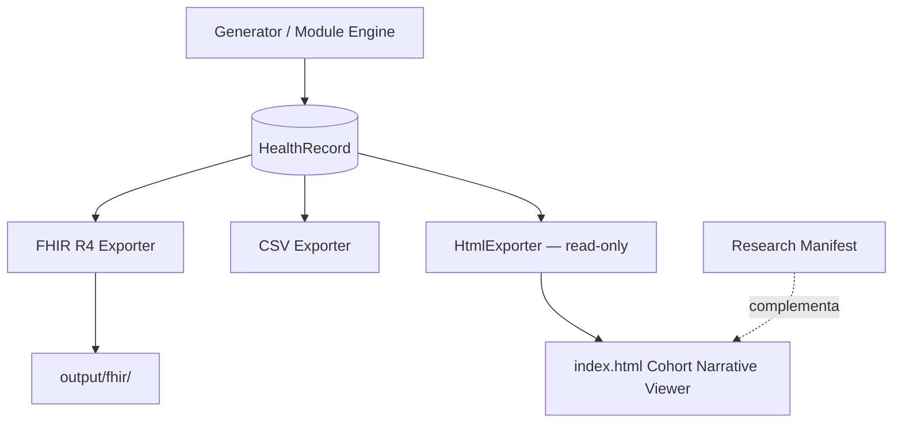
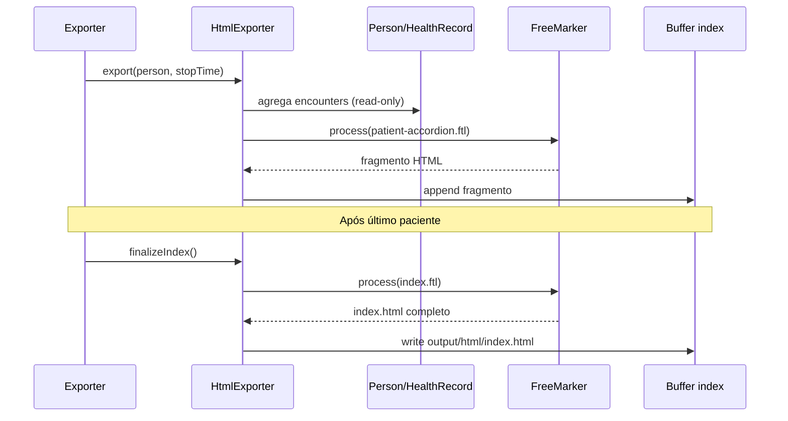

# Diagramas — Cohort Narrative Viewer

## Pipeline de export

```mermaid
flowchart LR
  Props[synthea.properties<br/>exporter.html.export=true] --> Exp[Exporter.export]
  HR[(HealthRecord / Person)] --> Prep[HtmlExporter prepara modelo]
  Exp --> Prep
  Prep --> FTL[FreeMarker templates/html/]
  FTL --> Acc[Fragmentos accordion acumulados]
  Acc --> Idx[index.html final]
  Idx --> Out[output/html/]
```

## Posição no runtime Synthea-br

```mermaid
flowchart TD
  Gen[Generator / Module Engine] --> HR[(HealthRecord)]
  HR --> FHIR[FHIR R4 Exporter]
  HR --> CSV[CSV Exporter]
  HR --> HTML[HtmlExporter — read-only]
  HTML --> Viewer[index.html Cohort Narrative Viewer]
  FHIR --> Bundle[output/fhir/]
  Man[Research Manifest] -.complementa.-> Viewer
```

## Fluxo de dados por paciente

```mermaid
sequenceDiagram
  participant E as Exporter
  participant H as HtmlExporter
  participant P as Person/HealthRecord
  participant T as FreeMarker
  participant B as Buffer index

  E->>H: export(person, stopTime)
  H->>P: agrega encounters (read-only)
  H->>T: process(patient-accordion.ftl)
  T-->>H: fragmento HTML
  H->>B: append fragmento
  Note over E,B: Após último paciente
  E->>H: finalizeIndex()
  H->>T: process(index.ftl)
  T-->>H: index.html completo
  H->>B: write output/html/index.html
```
