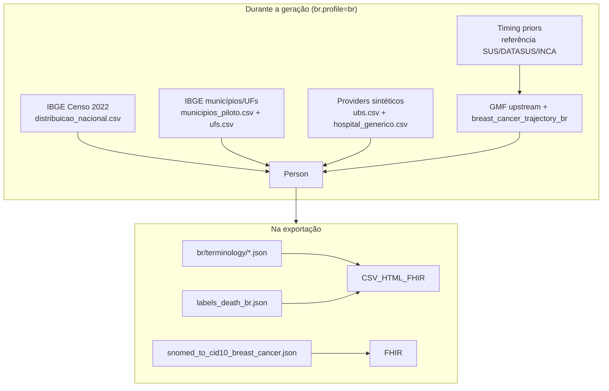

# Fontes do contexto brasileiro — Synthea-br

Referência das **fontes de dados e curadoria** que o fork Synthea-br utiliza para localizar a geração de cohorts sintéticas ao contexto brasileiro.

> **Escopo:** documento descritivo do estado atual do repositório. Para **como ativar** o perfil BR na prática, veja [GUIA-DE-USO.md §7](GUIA-DE-USO.md#7-modo-brasileiro-brprofilebr).

**Última revisão:** 2026-07-10

---

## Chave mestra

Toda a localização BR depende de **`br.profile=br`**, verificada em runtime por `BrProfile.isActive()` (`org.mitre.synthea.br.profile.BrProfile`).

Sem essa flag, o motor preserva demografia, geografia, providers e textos clínicos no padrão **upstream (EUA)**.

---

## Visão geral por momento

| Momento | Camadas | Fontes predominantes |
|---------|---------|----------------------|
| **Durante a simulação** | Demografia, geografia, providers, módulos GMF, timing de fases | IBGE 2022, CSVs piloto, GMF upstream + extensões BR |
| **Na exportação** | Terminologia PT-BR, CID-10, datas HTML, DO | Data packs JSON curados, mapeamento SNOMED→CID-10 piloto |
| **Pós-geração** | Plausibilidade, manifesto, relatório de termos não mapeados | Catálogos internos, metadados da run |



---

## 1. Demografia

### Fonte oficial declarada

**IBGE — Censo Demográfico 2022** (população residente, Brasil, granularidade **nacional**).

Comentário no data pack:

```text
# Fonte: IBGE, Censo Demográfico 2022 — população residente, Brasil (nacional, não municipal).
# Tabela 2629 (cor ou raça) e agregados de sexo e idade (grupos quinquenais).
```

### Arquivo

| Caminho | Conteúdo |
|---------|----------|
| `src/main/resources/br/demographics/distribuicao_nacional.csv` | Faixas etárias quinquenais, sexo, raça/cor IBGE, educação, renda, idioma |

### Integração no código

- **Classe:** `org.mitre.synthea.br.demographics.BrDemographicsLoader`
- **Ponto de uso:** `Generator.pickDemographics()` — substitui o picker demográfico US quando `BrProfile.isActive()`

### Raça/cor IBGE → modelo interno

O IBGE usa cinco categorias (`branca`, `preta`, `parda`, `amarela`, `indígena`). O Synthea upstream usa chaves US Census (`white`, `black`, `asian`, `native`, `other`).

A categoria **parda** (~45% no Censo 2022) não tem equivalente 1:1. O mapeamento interim está em `BrRaceMapper` e documentado em [ADR-003](research/adr/ADR-003-mapeamento-raca-cor-ibge.md):

- `branca` → `white`
- `preta` → `black`
- `amarela` → `asian`
- `indígena` → `native`
- `parda` → split 40% `black` / 60% `other`

**Limitação:** proporções IBGE sim, taxonomia FHIR US Core ainda não reflete categorias IBGE nativas.

---

## 2. Geografia

### Fontes declaradas

| Arquivo | Fonte | Uso |
|---------|-------|-----|
| `src/main/resources/br/geography/municipios_piloto.csv` | **IBGE** (Censo 2022) + faixas de **CEP** aproximadas (Correios/IBGE) | Sorteio de município, lat/lon, CEP |
| `src/main/resources/br/geography/ufs.csv` | **IBGE** — bounding boxes simplificados por UF | Validação de coordenadas, nome completo da UF |

### Integração no código

- **Classe:** `org.mitre.synthea.br.geography.BrGeographyResolver`
- **Pontos de uso:**
  - `Generator.pickDemographics()` — cidade, UF, coordenadas iniciais
  - `LifecycleModule.birth()` — CEP, coordenadas, local de nascimento

### Comportamento

Com `br.profile=br`, a geografia de cada paciente é sorteada entre o **subset piloto** (~25–30 municípios: capitais e cidades médias), **ponderado por população**, independentemente de `state`/`city` passados no estilo CLI upstream.

### Limitação

Não cobre os **5.570 municípios** brasileiros. Expansão é iterativa pós-MVP.

---

## 3. Providers (rede assistencial)

### Fontes

| Arquivo | Origem |
|---------|--------|
| `src/main/resources/br/providers/ubs.csv` | **100% sintético** — UBS fictícias (Story 3.4) |
| `src/main/resources/br/providers/hospital_generico.csv` | **100% sintético** — hospitais genéricos fictícios |

Os CSVs são gerados por `scripts/gen_br_providers.py` a partir de `municipios_piloto.csv` e `ufs.csv` (coordenadas, CEP, nome da UF).

### Integração no código

- **Classes:** `BrProviderConfig`, `BrProviderLoader`
- **Ponto de uso:** `Generator` — substitui `providers/hospitals.csv` e `providers/primary_care_facilities.csv` US

### Limitação

**Não** utiliza CNES, DATASUS ou cadastro real de estabelecimentos (NFR5 — sem PHI). São unidades fictícias posicionadas nos municípios piloto.

---

## 4. Simulação clínica (motor GMF)

A lógica clínica principal continua nos **módulos GMF upstream (MITRE/EUA)**, em especial `modules/breast_cancer.json` e submódulos (`chemotherapy_breast.json`, `staging_imaging_breast.json`, etc.).

### Extensões BR específicas

| Recurso | Papel | Fonte de referência |
|---------|-------|---------------------|
| `modules/breast_cancer_trajectory_br.json` | Marcadores de fase (`pathway_phase`) no modo episódico | Curadoria interna (Epic 9), alinhado ao catálogo 9.2 |
| `src/main/resources/br/pathways/breast_cancer_phases.json` | Catálogo de fases PT-BR (rastreio → seguimento) | Curadoria + códigos SNOMED/LOINC upstream |
| `src/main/resources/br/pathways/breast_cancer_timing_priors.json` | Intervalos entre fases (dias) | **Referência normativa:** SUS/DATASUS, INCA; **bibliografia:** OncoSynth, Coogee — metadado apenas, **sem runtime ML/LLM** |
| `src/main/resources/keep_modules/br/breast_cancer.json` | Gate de condição-alvo (`br.target_condition=breast_cancer`) | SNOMED `254837009` |

Property de timing: `br.pathway.timing_priors=default` carrega `breast_cancer_timing_priors.json` via `PathwayTimingLoader`.

### Nota metodológica (ADR-008)

[SUS/DATASUS/INCA](research/adr/ADR-008-trajetoria-clinica-focada.md) informam **ordem macro de fases** e **timings agregados públicos**. OncoSynth e Coogee aparecem como **referências bibliográficas** em `reference_notes` — não são APIs consultadas durante a geração.

---

## 5. Codificação clínica (CID-10)

### Fonte atual

**Curadoria manual provisória** — decisão registrada em [ADR-005](research/adr/ADR-005-fonte-cid10-br.md).

| Arquivo | Mapeamento |
|---------|------------|
| `src/main/resources/br/coding/snomed_to_cid10_breast_cancer.json` | SNOMED `254837009` → CID-10 **`C50.9`** (neoplasia maligna da mama, não especificada) |

### Integração

- **Classe:** `org.mitre.synthea.br.coding.BrCodeMapper`
- **Comportamento:** adiciona `Coding` CID-10 **aditiva** no FHIR R4; SNOMED original preservado

### Pendências

- Fonte oficial CID-10 BR (**DATASUS/TabCID** vs **WHO ICD-10**) ainda não decidida formalmente pelo grupo PUCPR
- **TUSS/SUS** (faturamento) **fora de escopo** do MVP

---

## 6. Terminologia clínica em português

### Política (ADR-006)

Documentada em [ADR-006](research/adr/ADR-006-terminologia-clinica-pt-br.md):

- Curadoria manual acadêmica
- Descritores LOINC em português quando disponíveis
- Descrições CID-10 (WHO) para fallback SNOMED
- **Não** redistribuir SNOMED CT BR licenciado no repositório

### Data packs (`src/main/resources/br/terminology/`)

Carregados por `BrTerminologyResolver`:

| Arquivo | Domínio |
|---------|---------|
| `labels_upstream.json` | Labels upstream (payers, emprego, etc.) |
| `labels_death_br.json` | Certificado de óbito / DO |
| `snomed_wellness_common.json` | Encontros e wellness |
| `snomed_breast_cancer_pilot.json` | Câncer de mama (piloto) |
| `snomed_sdoh_extended.json` | Determinantes sociais (HRSN) |
| `snomed_dental_extended.json` | Odontologia |
| `snomed_pain_infections.json` | Dor, IVU, sinusite |
| `loinc_wellness_labs.json` | Laboratório (CBC, BMP, lipídios) |
| `loinc_screening_scores.json` | Escores (GAD-7, Morse, PHQ-2, AUDIT-C) |
| `rxnorm_pilot.json` | Medicamentos piloto (mama) |
| `rxnorm_cohort_common.json` | Medicamentos comuns de cohort |

### Comportamento

- Ativo somente com `br.profile=br`
- Localiza `display`/`text` em **CSV, HTML e FHIR R4** na exportação
- **Não muta** `HealthRecord` (AD-2)
- Códigos SNOMED/RxNorm/LOINC permanecem inalterados

### Relatório incremental

Após geração com export CSV:

```text
output/{timestamp}/br/terminology/_unmapped_report.csv
```

Lista códigos ainda sem tradução — insumo para expandir os JSON. Desativar: `br.terminology.report.enabled=false`.

---

## 7. Óbito / Declaração de Óbito (DO)

### Fonte

Curadoria manual — conceito brasileiro de **Declaração de Óbito (DO/SIM/MS)** em substituição ao certificado US.

| Componente | Caminho / classe |
|------------|------------------|
| Labels | `br/terminology/labels_death_br.json` |
| Hook na simulação | `org.mitre.synthea.br.lifecycle.BrDeathCertification` |

Códigos LOINC/SNOMED upstream (ex.: `69409-1`, `69453-9`) são **preservados**; apenas o texto legível muda (ex.: "Causa da morte (DO)").

---

## 8. Plausibilidade e rastreabilidade

| Recurso | Fonte | Saída |
|---------|-------|-------|
| `br/plausibility/catalog_breast_cancer.json` | Regras curadas internamente (ordem diagnóstico→tratamento) | `plausibility_report.json` |
| `ResearchManifestWriter` | Metadados da configuração e hashes | `manifest.json` |

Nenhum consome APIs externas em tempo de geração.

Properties relacionadas (defaults em `synthea.properties`):

- `br.plausibility.report.enabled=true`
- `br.manifest.enabled=true`

---

## 9. O que **não** é brasileiro hoje

| Aspecto | Situação atual |
|---------|----------------|
| **Nomes de pacientes** | Gerados pelo mecanismo upstream (nomes US / padrão MITRE) |
| **Módulos clínicos GMF** | Majoritariamente upstream (EUA) |
| **Códigos clínicos** | SNOMED-CT, RxNorm, LOINC internacionais |
| **Taxonomia FHIR raça** | US Core / OMB — IBGE nas proporções e coluna `ETHNICITY` CSV |
| **Estabelecimentos de saúde** | Fictícios — não CNES |
| **CID-10 completo** | Piloto manual (`C50.9` para mama) — não TabCID |
| **Enriquecimento por IA** (`br.ai.*`) | BYOK opcional (OpenAI etc.) — narrativa pós-geração, **não** fonte primária de coerência clínica |

---

## 10. Mapa arquivo → classe Java

| Data pack / recurso | Classe integradora |
|---------------------|-------------------|
| `br/demographics/distribuicao_nacional.csv` | `BrDemographicsLoader`, `BrRaceMapper` |
| `br/geography/*.csv` | `BrGeographyResolver` |
| `br/providers/*.csv` | `BrProviderLoader` |
| `br/coding/snomed_to_cid10_breast_cancer.json` | `BrCodeMapper` |
| `br/terminology/*.json` | `BrTerminologyResolver`, `BrUnmappedCodeReporter` |
| `br/pathways/breast_cancer_phases.json` | `PathwayCatalog` |
| `br/pathways/breast_cancer_timing_priors.json` | `PathwayTimingLoader` |
| `modules/breast_cancer_trajectory_br.json` | Carregado pelo `Generator` (modo episódico) |
| `keep_modules/br/breast_cancer.json` | `TargetConditionConfig`, gate retry/exclude |
| — | `BrProfile` (flag mestra) |
| — | `BrDeathCertification` (DO) |

---

## 11. ADRs e documentação relacionada

| Documento | Tema |
|-----------|------|
| [ADR-003](research/adr/ADR-003-mapeamento-raca-cor-ibge.md) | Raça/cor IBGE → categorias internas |
| [ADR-005](research/adr/ADR-005-fonte-cid10-br.md) | Fonte CID-10 (provisória) |
| [ADR-006](research/adr/ADR-006-terminologia-clinica-pt-br.md) | Terminologia PT-BR na exportação |
| [ADR-008](research/adr/ADR-008-trajetoria-clinica-focada.md) | Trajetória clínica e referências SUS/DATASUS/INCA |
| [GUIA-DE-USO.md §7](GUIA-DE-USO.md#7-modo-brasileiro-brprofilebr) | Como ativar e o que muda na prática |
| [CONTRIBUTING-ACADEMICO.md](CONTRIBUTING-ACADEMICO.md) | Workflow acadêmico e citação |

---

## Resumo em uma frase

O Synthea-br **ancora demografia e geografia no IBGE 2022**, posiciona **rede assistencial fictícia** nos municípios piloto, **simula clínica** com GMF upstream complementado por catálogos/módulos BR, e **localiza a saída** (português + CID-10 piloto) via data packs curados — **sem microdados reais** de SUS, CNES ou DATASUS em runtime.
