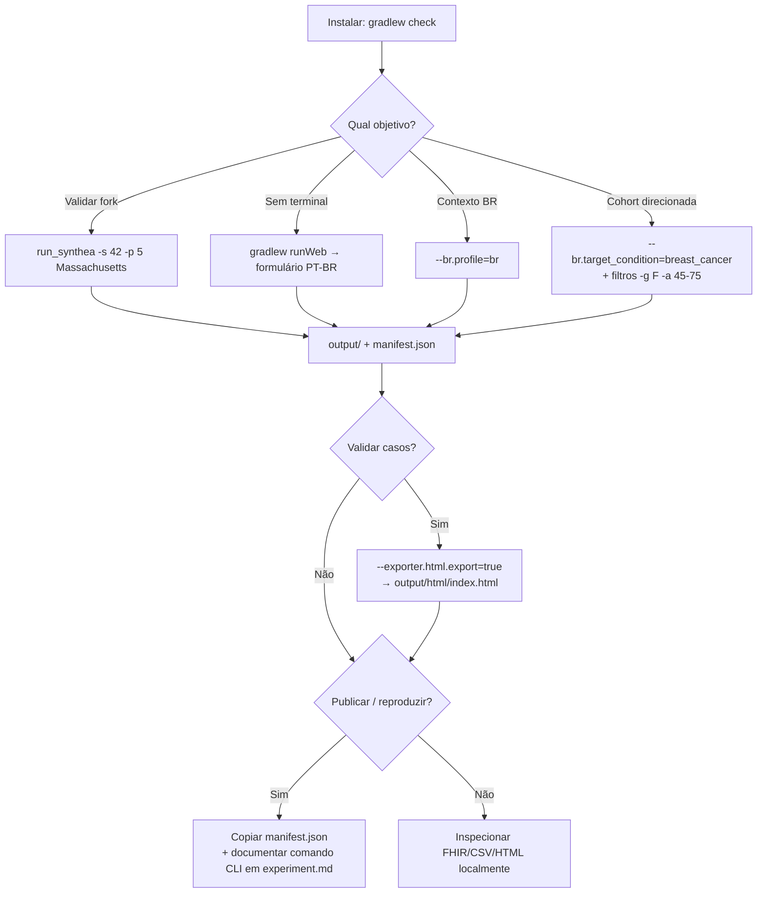
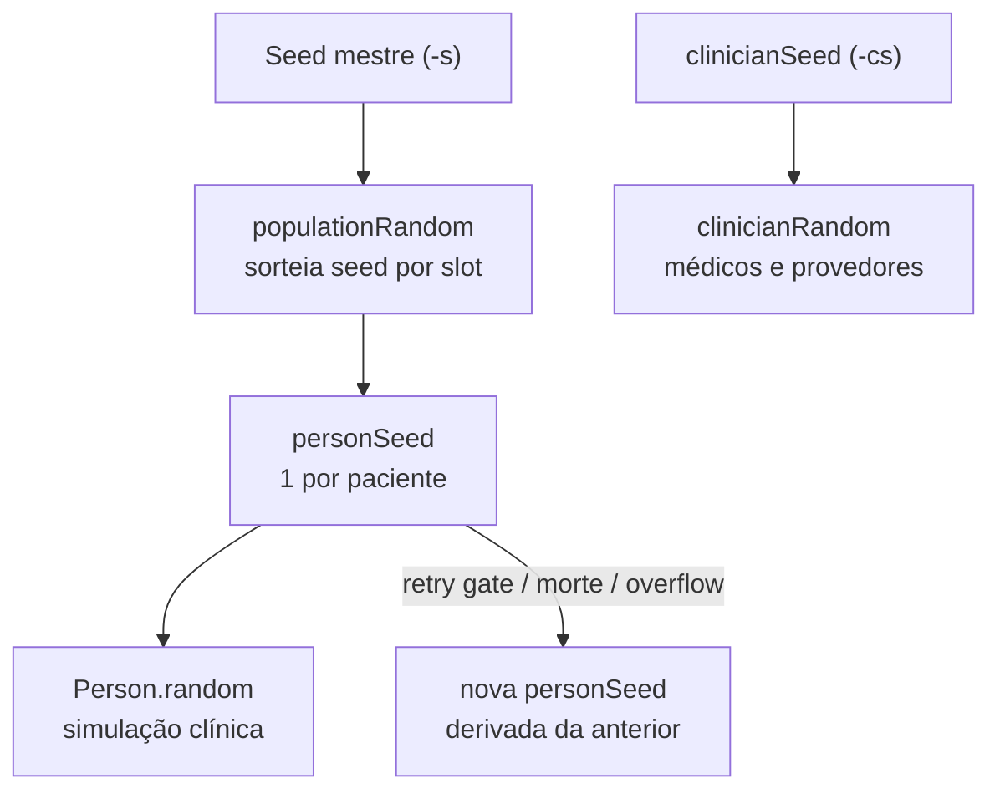

# Guia de Uso — Synthea-br

Guia didático em Português do Brasil para **usar** o fork acadêmico **Synthea-br** (PUCPR): instalar, gerar pacientes sintéticos, ativar o contexto brasileiro e produzir cohorts reprodutíveis para pesquisa.

> **Para quem é este guia?** Pesquisadores, estudantes e desenvolvedores que querem **rodar** o gerador — não apenas contribuir com código. Se você vai documentar experimentos ou citar o fork em artigos, complemente com [`CONTRIBUTING-ACADEMICO.md`](CONTRIBUTING-ACADEMICO.md).

---

## 1. O que é o Synthea-br?

O [Synthea](https://github.com/synthetichealth/synthea) upstream simula vidas inteiras de pacientes fictícios e exporta prontuários em FHIR, CSV, C-CDA etc. — com demografia e geografia **centradas nos EUA**.

O **Synthea-br** mantém o motor upstream e adiciona:

| Capacidade | Para quê serve |
|------------|----------------|
| **Perfil brasileiro** (`br.profile=br`) | Demografia IBGE, municípios BR, providers BR, codificação CID-10 piloto |
| **Condição clínica alvo** (`br.target_condition`) | Gerar cohort onde todos (ou quase todos) têm a condição desejada — MVP: câncer de mama |
| **Manifest de rastreabilidade** | Arquivo `output/{timestamp}/manifest.json` com seed, hash de config, commit e checksum — reprodutibilidade acadêmica |
| **HTML narrativo** (`exporter.html.export=true`, Epic 6) | `output/{timestamp}/html/index.html` — visão por paciente com timeline e seções clínicas, offline no browser |
| **Interface web** (`gradlew runWeb`, Epic 7) | Formulário local em PT-BR para configurar e disparar gerações sem memorizar flags CLI |

**Importante:** todos os dados são **100% sintéticos**. O fork **não** é validado para uso clínico real (diagnóstico, tratamento ou decisões assistenciais).

---

## 2. Pré-requisitos

| Requisito | Detalhe |
|-----------|---------|
| **Java (JDK)** | 17 ou superior (LTS recomendado: 17 ou 25) |
| **Git** | Para clonar o repositório |
| **Gradle** | Já incluído via wrapper (`gradlew` / `gradlew.bat`) — não precisa instalar |
| **Sistema operacional** | Windows, Linux ou macOS |

Verifique o Java:

```bash
java -version
```

Deve mostrar versão 17 ou superior.

---

## 3. Instalação

### 3.1 Clonar o repositório

```bash
git clone <URL-do-seu-fork-ou-repo>
cd synthea
```

### 3.2 Validar que tudo funciona

```bash
# Linux / macOS
./gradlew check

# Windows (PowerShell ou CMD)
gradlew.bat check
```

Este comando compila o projeto, roda testes, Checkstyle e JaCoCo. Espere alguns minutos na primeira execução (download de dependências).

Se `./gradlew check` passar, a instalação está OK.

### 3.3 Atalho: interface web (Epic 7)

Alternativa ao terminal para quem prefere formulário em vez de flags:

```bash
# Linux / macOS
./gradlew runWeb

# Windows
gradlew.bat runWeb
# ou
run_synthea.bat --web
```

Abra **http://127.0.0.1:8080** (porta em `br.web.port`, padrão `8080`).

Detalhes completos — campos, status, limites e quando preferir CLI — na [§10 Interface web](#10-interface-web-epic-7).

---

## 4. Sua primeira geração (modo upstream / EUA)

O modo padrão reproduz o comportamento do Synthea original — útil para validar a instalação antes de ativar recursos BR.

```bash
# Linux / macOS — 5 pacientes em Massachusetts, seed fixa 42
./run_synthea -s 42 -p 5 Massachusetts

# Windows — equivalente
run_synthea.bat -s 42 -p 5 Massachusetts
```

### O que acontece?

1. O motor simula vidas completas (nascimento → envelhecimento → morte, conforme módulos clínicos).
2. Os arquivos exportados vão para uma **subpasta timestampada** dentro de **`output/`** (ignorada pelo Git), por exemplo `output/2026-07-03_190915/`.
3. Ao final, é escrito **`manifest.json`** dentro dessa subpasta, com metadados de rastreabilidade.

### Ver a ajuda completa

```bash
./run_synthea -h
# ou: run_synthea.bat -h
```

Parâmetros mais usados:

| Parâmetro | Significado | Exemplo |
|-----------|-------------|---------|
| `-s` | Seed mestre da população (reprodutibilidade) | `-s 42` |
| `-cs` | Seed de clínicos/provedores (recomendado junto com `-s`) | `-cs 42` |
| `-p` | Tamanho da população | `-p 100` |
| `-g` | Gênero (`M` ou `F`) | `-g F` |
| `-a` | Faixa etária | `-a 50-70` |
| `-c` | Arquivo de config alternativo | `-c meu.properties` |
| `--chave=valor` | Sobrescreve qualquer property | `--exporter.csv.export=true` |

Detalhes sobre os três níveis de seed, retries do gate e limites do determinismo: [§13](#13-como-funciona-a-seed).

---

## 5. Entendendo a saída

Após uma geração, explore a subpasta criada em `output/` (nome com data/hora da execução):

```
output/
├── 2026-07-03_190915/          # Uma pasta por execução (padrão Synthea-br)
│   ├── fhir/                   # Bundles FHIR R4 (se habilitado)
│   ├── csv/                    # CSVs tabulares (se exporter.csv.export=true)
│   ├── html/                   # HTML narrativo (se exporter.html.export=true)
│   │   └── index.html
│   ├── manifest.json           # Rastreabilidade acadêmica (Synthea-br)
│   └── metadata/               # Metadados (se exporter.metadata.export=true)
└── 2026-07-03_201530/          # Execução anterior preservada
    └── ...
```

Por padrão, **`br.output.timestamped_runs=true`**: cada run cria uma nova subpasta e **não sobrescreve** cohorts anteriores. Para voltar ao comportamento upstream (sempre gravar direto em `output/`), use `br.output.timestamped_runs=false` em `synthea.properties` ou `--br.output.timestamped_runs=false` no CLI.

### HTML narrativo (`output/{timestamp}/html/index.html`)

Quando `exporter.html.export=true`, a cohort inteira vira **um único HTML5** abrível offline (sem servidor). Cada paciente aparece em um accordion colapsável com cabeçalho de triagem (idade, sexo, condição principal, último evento) e, ao expandir, timeline cronológica + seções: demografia, condições, medicamentos, exames, procedimentos, atendimentos e cobertura.

Com `br.profile=br`, rótulos de UI e **textos clínicos mapeados** em PT-BR (terminologia incremental — ver [§7](#7-modo-brasileiro-brprofilebr)); datas no HTML em `dd/MM/yyyy`. Ver [§9](#9-visualizador-narrativo-html-epic-6).

### manifest.json

Exemplo de estrutura:

```json
{
  "seed": 42,
  "config_hash": "abc123...",
  "commit_sha": "0e32c32b...",
  "output_checksum": "def456...",
  "generated_at_iso8601": "2026-06-30T15:00:00Z"
}
```

| Campo | Uso |
|-------|-----|
| `seed` | Seed mestre (`-s`); mesma seed + mesma config → mesma população — ver [§13](#13-como-funciona-a-seed) |
| `config_hash` | Identifica a configuração exata usada |
| `commit_sha` | Versão do código no momento da geração |
| `output_checksum` | Hash dos arquivos exportados (reprodutibilidade) |

Para pesquisa acadêmica oficial do grupo, **preserve** este arquivo junto com o experimento. Desabilitar (não recomendado): `br.manifest.enabled = false` em `synthea.properties`.

---

## 6. Configuração: arquivo vs linha de comando

As opções padrão ficam em:

```
src/main/resources/synthea.properties
```

**Não edite esse arquivo diretamente** para experimentos pontuais — prefira:

1. **CLI** (rápido, reprodutível no comando):
   ```bash
   run_synthea.bat -s 42 -p 10 --br.profile=br --exporter.csv.export=true
   ```

2. **Cópia local** (`-c meu.properties`) para experimentos repetidos.

### Exportações comuns

Por padrão, só **FHIR R4** está ativo. Para ativar outros formatos:

```properties
exporter.fhir.export = true          # FHIR R4 (padrão: true)
exporter.csv.export = true           # CSV tabular
exporter.html.export = true          # HTML narrativo da cohort (Epic 6)
exporter.ccda.export = true          # C-CDA
exporter.fhir.bulk_data = true       # FHIR bulk (ndjson)
```

Via CLI:

```bash
run_synthea.bat -p 10 --exporter.csv.export=true
```

Saída em subpasta customizada:

```bash
run_synthea.bat -p 10 --exporter.baseDirectory=./output_experimento/
```

---

## 7. Modo brasileiro (`br.profile=br`)

Ative o perfil de localização brasileiro quando precisar de contexto BR em vez de defaults EUA.

```bash
run_synthea.bat -s 42 -p 100 --br.profile=br
```

### O que muda?

| Aspecto | Comportamento |
|---------|---------------|
| **Idade, sexo, raça/cor** | Distribuições nacionais IBGE (Censo 2022), não census US |
| **Colunas CSV `RACE` / `ETHNICITY`** | `RACE` = categorias US Census traduzidas (`branca`, `preta`, `amarela`, `indigena`, `outro`); `ETHNICITY` = raça/cor IBGE (`branca`, `parda`, `preta`, etc.) |
| **Município / UF / CEP** | Sorteio ponderado por população a partir do **subset piloto** (~25 municípios — capitais e cidades médias) |
| **Providers** | UBS e hospital genérico BR (CSV em `src/main/resources/br/providers/`) |
| **Codificação clínica** | Mapeamento SNOMED → CID-10 piloto (ex.: câncer de mama) nos exportadores FHIR |
| **Terminologia clínica (texto)** | Data packs PT-BR em `src/main/resources/br/terminology/` — condições, meds, procedimentos e exames traduzidos nos exports HTML, FHIR R4 e CSV quando mapeados |
| **Datas no HTML** | Formato `dd/MM/yyyy` (pt-BR); CSV mantém ISO `yyyy-MM-dd` |

### Terminologia em português (incremental)

Com `br.profile=br`, textos clínicos visíveis passam por `BrTerminologyResolver`:

- **Mapeados** → exibidos em português (ex.: `NO_INSURANCE` → "Sem cobertura", câncer de mama → "Neoplasia maligna da mama", hemograma → "Hemograma completo — sangue").
- **Não mapeados** → permanecem em inglês (fallback upstream).
- **Fallback por texto** — entradas em `labels_upstream.json` e packs com chave LABEL (ex.: "Not in labor force (finding)" → "Fora da força de trabalho") são aplicadas quando o código SNOMED ainda não está no pack numérico.
- **Óbito (DO)** — com perfil BR, certificado US é exibido como **Declaração de Óbito (DO)** e **Causa da morte (DO)** (`BrDeathCertification`).

Data packs por domínio (cohort câncer de mama + wellness):

| Arquivo | Conteúdo |
|---------|----------|
| `labels_upstream.json`, `labels_death_br.json` | Payers, emprego, certificado de óbito BR |
| `snomed_wellness_common.json`, `snomed_breast_cancer_pilot.json` | Encontros, mama, SDOH base |
| `snomed_sdoh_extended.json`, `snomed_dental_extended.json`, `snomed_pain_infections.json` | HRSN, odontologia, dor, IVU, sinusite |
| `loinc_wellness_labs.json`, `loinc_screening_scores.json` | CBC/BMP/lipídios, GAD-7, Morse, PHQ-2, AUDIT-C |
| `rxnorm_pilot.json`, `rxnorm_cohort_common.json` | Medicamentos hormônios mama, opioides, antibióticos |

Cobertura esperada no cohort `breast_cancer`: **~70–85%** das descrições clínicas em PT-BR nos CSV/HTML (labs TNM e oncologia avançada podem permanecer em inglês até packs futuros).

Após cada geração com export CSV, o relatório `output/{timestamp}/br/terminology/_unmapped_report.csv` (ou `output/br/terminology/` quando runs timestampadas estão desativadas) lista códigos ainda sem tradução — use-o para expandir os JSON em `br/terminology/`. Ver [ADR-006](research/adr/ADR-006-terminologia-clinica-pt-br.md).

Desativar o relatório: `br.terminology.report.enabled=false` em `synthea.properties`.

### O que ainda **não** muda no MVP?

- **Etnia** (`hispanic`/`nonhispanic`), **idioma** e variáveis **socioeconômicas** (renda, educação) continuam calibradas como no upstream US até stories futuras.
- **Raça/cor nos exports FHIR** ainda usa categorias internas US Census — o IBGE é refletido nas **proporções**, não na taxonomia FHIR. Ver [ADR-003](research/adr/ADR-003-mapeamento-raca-cor-ibge.md).

### Municípios disponíveis (piloto)

Lista em `src/main/resources/br/geography/municipios_piloto.csv` — inclui São Paulo, Rio de Janeiro, Curitiba, Belo Horizonte, Salvador, Brasília, etc. **Não** cobre os 5.570 municípios do IBGE; expansão é iterativa pós-MVP.

Com `br.profile=br`, a geografia de cada paciente é sorteada entre esses municípios (ponderado por população), independentemente do estado/cidade passados na linha de comando no estilo upstream.

---

## 8. Cohort com condição garantida (`br.target_condition`)

Para gerar pacientes **com câncer de mama** (única condição suportada no MVP):

```bash
run_synthea.bat -s 42 -p 20 -g F -a 45-75 ^
  --br.profile=br ^
  --br.target_condition=breast_cancer
```

> No PowerShell, use `` ` `` no lugar de `^` para continuar linhas, ou escreva tudo em uma linha.

### Por que `-g F` e `-a 45-75`?

O módulo de gate de câncer de mama foi calibrado para um recorte demográfico (mulheres, faixa etária compatível). Sem filtro de gênero/idade, o motor pode precisar de **muitas tentativas** por paciente aceito — até atingir `generate.max_attempts_to_keep_patient`.

### Modos de gate

| Property | Valor | Comportamento |
|----------|-------|---------------|
| `br.target_condition.gate_mode` | `retry` (padrão) | Regenera a simulação (keep module nativo) até o paciente satisfazer a condição; falha se exceder `generate.max_attempts_to_keep_patient` |
| `br.target_condition.gate_mode` | `exclude` | Regenera descartando não conformes **sem exportar**; garante `-p` pacientes exportados conformes; loga quantos foram excluídos |

Exemplo com modo exclude (10 exportados conformes, não 10 tentativas):

```bash
run_synthea.bat -s 42 -p 10 -g F -a 45-75 ^
  --br.profile=br ^
  --br.target_condition=breast_cancer ^
  --br.target_condition.gate_mode=exclude ^
  --exporter.csv.export=true
```

Ao final, o log deve mostrar algo como:
`Synthea-br gate (exclude): requested=10 exported=10 excluded=N conforming=100.0%`

### Condição inválida

Valores não suportados (ex.: `diabetes_tipo_x`) geram erro claro na inicialização — consulte `synthea.properties` para a lista atual.

### Trajetória clínica focada (Epic 9 — Abordagens C, D, E)

| Abordagem | Property | Efeito |
|-----------|----------|--------|
| **C — Export enxuto** | `br.pathway.focus=true` | CSV/FHIR exportam só eventos do catálogo de fases (+ demografia); simulação completa preservada |
| **D — Geração enxuta** | `br.generation.module_profile=pathway_minimal` | Carrega allowlist curada de módulos GMF (menos comorbidades na origem) |
| **E — GMF episódico** | `br.generation.trajectory_mode=episodic` | Carrega `modules/breast_cancer_trajectory_br.json` **em paralelo** ao módulo upstream `breast_cancer` — marca fases (`pathway_phase`) |

Combinação recomendada para cohort piloto de câncer de mama:

```bash
run_synthea.bat -s 42 -p 10 -g F -a 45-75 ^
  --br.profile=br ^
  --br.target_condition=breast_cancer ^
  --br.generation.module_profile=pathway_minimal ^
  --br.generation.trajectory_mode=episodic ^
  --br.pathway.focus=true ^
  --exporter.fhir.export=true
```

**Trade-offs:** `lifespan` (padrão) simula vida inteira com módulo upstream; `episodic` estrutura fases explícitas (rastreio→…→seguimento) antes de delegar ao submodule clínico. O perfil `pathway_minimal` substitui uso ad hoc de `-m` — é conjunto testado e versionado em `br/generation/module_profiles/`.

---

## 9. Visualizador narrativo HTML (Epic 6)

O **Cohort Narrative Viewer** transforma a cohort gerada em um relatório legível para validação com orientadores — sem cruzar CSVs ou abrir dezenas de JSON FHIR.

### Ativar

```bash
run_synthea.bat -s 42 -p 10 -g F -a 45-75 ^
  --br.profile=br ^
  --br.target_condition=breast_cancer ^
  --exporter.html.export=true
```

Ou em `synthea.properties`:

```properties
exporter.html.export = true
```

Com a flag **desligada** ou ausente (`false`, padrão), **nada** é escrito em `output/html/`.

### O que você vê no browser

Abra `output/html/index.html` com duplo clique ou arraste para o navegador:

| Elemento | Conteúdo |
|----------|----------|
| **Accordion (fechado)** | Idade, sexo, condição principal, data e rótulo do último evento |
| **Timeline** | Eventos clínicos em ordem cronológica (≥1 por paciente) |
| **Seções aninhadas** | Demografia, condições, medicamentos, exames, procedimentos, atendimentos, cobertura |
| **Seção vazia** | Mensagem graciosa (“Sem registros”) — não quebra o layout |

A página usa `<details>`/`<summary>` — **não exige JavaScript** para expandir/colapsar.

### Localização BR

Com `br.profile=br`:

- Títulos de seção e rótulos de UI em **português do Brasil**.
- Condições do piloto exibem **CID-10 BR** quando há mapeamento (ex.: câncer de mama via Story 3.3).

Sem perfil BR, o HTML ainda é gerado; labels seguem o padrão do exportador.

### Combinar com outros formatos

O HTML é **complementar** a FHIR/CSV — lê o mesmo `HealthRecord`, sem alterar a simulação:

```bash
run_synthea.bat -s 42 -p 20 -g F -a 45-75 ^
  --br.profile=br ^
  --br.target_condition=breast_cancer ^
  --exporter.fhir.export=true ^
  --exporter.csv.export=true ^
  --exporter.html.export=true
```

### Limitações do MVP (Epic 6)

- **Arquivo único** com todos os pacientes — cohorts muito grandes (centenas+) podem ficar pesadas no browser; para n≈500, teste no seu ambiente antes de apresentar.
- Sem busca/filtro, split por paciente, link para FHIR individual ou rodapé com seed/manifest no HTML (roadmap v1.1).
- Não substitui validação estruturada FHIR (HAPI validator) nem relatório de plausibilidade (Epic 4).

---

## 10. Interface web (Epic 7)

Formulário **local** para configurar parâmetros e disparar a geração. Decisão registrada em [ADR-006](research/adr/ADR-006-interface-web-localhost-mvp.md).

> **Papers e reprodutibilidade:** a CLI continua sendo o caminho preferido — o comando exato cabe na seção Methods. A web aplica o **mesmo** `Generator` + `Config`, mas documentar flags no terminal evita ambiguidade.

### Iniciar o servidor

```bash
./gradlew runWeb          # Linux / macOS
gradlew.bat runWeb        # Windows
run_synthea.bat --web     # alternativa Windows
```

Navegue para **http://127.0.0.1:8080** (host `br.web.bind`, porta `br.web.port`).

| Property | Padrão | Função |
|----------|--------|--------|
| `br.web.bind` | `127.0.0.1` | Só localhost — **não** exponha `0.0.0.0` em rede compartilhada sem revisão |
| `br.web.port` | `8080` | Porta HTTP |
| `br.web.default_seed` | `42` | Seed sugerida no formulário |
| `br.web.default_population` | `10` | População sugerida no formulário (independente do default CLI `generate.default_population=1`) |

### Formulário (PT-BR)

| Campo | Equivalente CLI / config |
|-------|--------------------------|
| Seed | `-s` (a web também fixa `-cs` com o mesmo valor) |
| Tamanho da população | `-p` — **exatamente N exportados** (1 por slot). Pacientes que falecem durante a simulação **contam** entre os N; a UI web desativa `overflow` para não gerar mortos *extras* além do tamanho pedido. |
| Gênero | `-g` (`M`, `F` ou qualquer) |
| Idade mín./máx. | `-a min-max` (ambos preenchidos) |
| Perfil brasileiro | `--br.profile=br` |
| Condição clínica alvo | `--br.target_condition=...` (MVP: `breast_cancer`) |
| Modo de gate | `--br.target_condition.gate_mode=retry\|exclude` (visível só com condição alvo) |
| Exportações | checkboxes → `exporter.fhir.export`, `exporter.csv.export`, `exporter.html.export` |
| Enriquecimento por IA | `--br.ai.enrichment.enabled=true` + provedor/modelo + API key (BYOK) — ver [§10.1](#101-enriquecimento-por-ia-epic-8) |

**Preset “cohort câncer de mama”:** preenche F, idade 45–75, perfil BR e condição `breast_cancer` — equivalente à receita CLI recomendada.

### 10.1 Enriquecimento por IA (Epic 8)

Orquestração **MAI-DxO** opcional: personas debatem o prontuário gerado e aplicam correções estruturadas **antes** do export. Decisão em [ADR-007](research/adr/ADR-007-ai-enrichment-maidxo.md).

**Requisitos:** `br.profile=br`, credencial do provedor (BYOK), população ≤ `br.ai.max_patients` (padrão 10).

| Property / flag | Padrão | Função |
|-----------------|--------|--------|
| `br.ai.enrichment.enabled` | `false` | Ativa pipeline MAI-DxO pós-geração |
| `br.ai.provider` | `openai` | `openai`, `gemini` ou `medgemma` |
| `br.ai.model` | `gpt-4o-mini` | Modelo do provedor (ver tabela abaixo) |
| `br.ai.api_key` | — | BYOK via CLI (`--br.ai.api_key=...`) ou formulário web |
| `br.ai.max_patients` | `10` | Limite de segurança por execução |
| `br.ai.max_iterations` | `5` | Rodadas de debate por paciente |

**Provedores e modelos (catálogo jul/2026):**

| Provedor | Credencial (BYOK) | Modelo padrão | Modelos disponíveis |
|----------|-------------------|---------------|---------------------|
| `openai` | Chave OpenAI (`sk-...`) | `gpt-4o-mini` | `gpt-5.5`, `gpt-5.5-pro`, `gpt-5.4`, `gpt-5.4-mini`, `gpt-4o`, `gpt-4o-mini` |
| `gemini` | Chave Gemini (AI Studio) | `gemini-2.5-flash` | `gemini-3.5-flash`, `gemini-3.1-pro-preview`, `gemini-2.5-flash`, `gemini-2.5-flash-lite`, `gemini-2.5-pro` |
| `medgemma` | Token Hugging Face (`hf_...`) com permissão **Inference Providers** | `google/medgemma-4b-it` | `google/medgemma-4b-it`, `google/medgemma-27b-text-it` |

**MedGemma:** usa a [Hugging Face Inference API](https://huggingface.co/docs/inference-providers) (`router.huggingface.co`). Os modelos MedGemma podem **ainda não** ter provider serverless no Hub — se a chamada falhar com HTTP 404/503, verifique a disponibilidade do modelo na página do repositório antes de usar.

**CLI (OpenAI):**

```bash
run_synthea.bat -s 42 -p 2 --br.profile=br --br.target_condition=breast_cancer -g F -a 45-75 ^
  --br.ai.enrichment.enabled=true --br.ai.provider=openai --br.ai.api_key=sk-...
```

**CLI (Gemini):**

```bash
run_synthea.bat -s 42 -p 2 --br.profile=br --br.ai.enrichment.enabled=true ^
  --br.ai.provider=gemini --br.ai.model=gemini-2.5-flash --br.ai.api_key=AIza...
```

**CLI (MedGemma via Hugging Face):**

```bash
run_synthea.bat -s 42 -p 2 --br.profile=br --br.ai.enrichment.enabled=true ^
  --br.ai.provider=medgemma --br.ai.model=google/medgemma-4b-it --br.ai.api_key=hf_...
```

**Saídas:** `output/br/ai/enrichment_log.json` + seção `ai_enrichment` em `manifest.json`. A camada IA é **não-determinística** — a seed governa apenas a geração inicial.

### Durante e após a geração

1. Clique **Gerar cohort** — apenas **um job** por vez; segundo envio retorna *“Geração em andamento”* (HTTP 409).
2. A página faz **polling a cada 2 s** e mostra estado (`idle` \| `running` \| `completed` \| `failed`), progresso e últimas linhas de log.
3. Ao concluir: links para a pasta `output/`, confirmação de `manifest.json` e, se marcou HTML narrativo, link para `output/html/index.html`.

A geração roda em **thread separada** — o browser não trava.

### API REST (referência)

| Endpoint | Método | Uso |
|----------|--------|-----|
| `/api/config/options` | GET | Defaults, condições suportadas, opções de export |
| `/api/generate` | POST | Inicia job (JSON no body) |
| `/api/generate/status` | GET | Estado, progresso, log tail, paths |

### O que a web **não** faz no MVP

- Autenticação ou multi-usuário
- Upload de `synthea.properties` customizado ou módulos `-d`
- Geografia upstream (state/city US) quando `br.profile=br` — municípios BR são sorteados automaticamente
- Jobs paralelos, Flexporter, snapshots `-i/-u`

---

## 11. Receitas prontas (copiar e colar)

### A — Validar instalação (EUA, 2 pacientes)

```bash
run_synthea.bat -s 42 -p 2 Massachusetts
```

### B — População brasileira genérica (100 pacientes)

```bash
run_synthea.bat -s 12345 -p 100 --br.profile=br
```

### C — Cohort BR de câncer de mama (20 pacientes, reprodutível)

```bash
run_synthea.bat -s 42 -cs 42 -p 20 -g F -a 45-75 --br.profile=br --br.target_condition=breast_cancer
```

### D — Export FHIR + CSV para análise tabular

```bash
run_synthea.bat -s 42 -p 50 --br.profile=br --exporter.csv.export=true --exporter.fhir.export=true
```

### E — Config em arquivo separado

1. Crie `experimento.properties` com:
   ```properties
   br.profile = br
   br.target_condition = breast_cancer
   exporter.fhir.export = true
   ```
2. Execute:
   ```bash
   run_synthea.bat -c experimento.properties -s 42 -p 30 -g F -a 45-75
   ```

### F — Cohort BR + HTML narrativo para apresentar ao orientador

```bash
run_synthea.bat -s 42 -p 10 -g F -a 45-75 ^
  --br.profile=br ^
  --br.target_condition=breast_cancer ^
  --exporter.html.export=true
```

Abra `output/html/index.html` no navegador.

### G — Mesmo fluxo via interface web

1. `gradlew.bat runWeb`
2. http://127.0.0.1:8080
3. Marque perfil BR, condição `breast_cancer`, export HTML (ou use o preset)
4. **Gerar cohort** → ao concluir, clique em **Abrir HTML narrativo**

---

## 12. Fluxo mental (diagrama)



---

## 13. Como funciona a seed

A seed no Synthea-br **não** é um único número que identifica cada paciente. É uma **cadeia de geradores pseudoaleatórios** que define o que é reprodutível entre execuções — e o que não é.

### Três níveis de aleatoriedade



| Nível | Flag / origem | O que controla |
|-------|---------------|----------------|
| **População** | `-s` | Sorteia a seed de cada um dos `-p` slots da cohort |
| **Paciente** | derivada de `-s` | Demografia, módulos clínicos, evolução da vida simulada |
| **Clínico** | `-cs` | Médicos, provedores e atribuições de atendimento |

### Seed mestre (`-s`)

Inicializa o gerador da população. Para cada slot (`-p N`), o motor **deriva uma seed de paciente** a partir dessa seed mestre — `-s 42 -p 10` **não** significa “10 pacientes com seed 42”, e sim “comece em 42 e derive 10 pacientes distintos”.

Com a **mesma** `-s`, **mesma** configuração (`config_hash`) e **mesmo** commit, você obtém a **mesma cohort exportada**.

Se você **omitir** `-s`, o padrão é o timestamp da execução — cada run gera pacientes diferentes.

### Seed por paciente (`personSeed`)

Cada `Person` recebe sua própria seed e a simula clínica inteira (idade, raça, município no perfil BR, onset de doenças, tratamentos etc.). A seed mestre fica registrada no paciente como `populationSeed` (visível em metadados FHIR).

### Rotação de seed (retries)

Quando um paciente **não passa nos critérios** — gate `breast_cancer`, morte com `overflow` ativo, keep module etc. — o motor **não reutiliza** a mesma seed (senão o próximo tentaria o mesmo destino). Uma nova seed é sorteada a partir da cadeia anterior, de forma **determinística**.

Isso significa:

- Mesma `-s` + mesma config → **mesmos pacientes finais**
- O **número de tentativas internas** (ex.: `excluded=N` no gate) também é reprodutível

Com `br.target_condition=breast_cancer` e filtros `-g F -a 45-75`, espere da ordem de **~20–25 simulações descartadas por paciente exportado** (centenas no total para `-p 10`, não dezenas de milhares). Sem filtros demográficos, o descarte sobe — ver [§8](#8-cohort-com-condição-garantida-brtarget_condition).

### Seed de clínico (`-cs`)

Stream **separado** para provedores e clínicos. No **CLI**, se você passa só `-s 42` **sem** `-cs`, o `clinicianSeed` permanece como o timestamp da execução e **varia a cada run** — o que pode alterar provedores atribuídos mesmo com `-s` fixo.

A **interface web** iguala as duas automaticamente (`seed` = `clinicianSeed`).

**Recomendação para papers e reprodutibilidade via CLI:**

```bash
run_synthea.bat -s 42 -cs 42 -p 10 --br.profile=br
```

### Flags especiais

| Flag | Função |
|------|--------|
| `-ps <seed>` | Gera **um único** paciente com seed fixa (debug) |
| `-i` / `-u` | Snapshot de população — continua cohort existente em vez de sortear do zero |
| `-f` | Demografia fixa por entidade (identity module) |
| `-r` / `-e` | Data de referência / fim da simulação — alteram o “hoje” da simulação |

### O que a seed governa — e o que não governa

| Fator | Reprodutível com mesma seed + config? |
|-------|--------------------------------------|
| Geração clínica (sem IA) | Sim |
| Retries do gate `breast_cancer` | Sim (mesma cadeia de seeds) |
| `clinicianSeed` omitido no CLI | **Não** — fixe com `-cs` |
| Datas `-r` / `-e` diferentes | **Não** |
| Enriquecimento MAI-DxO (`br.ai.*`) | **Não** — camada declarada não-determinística |
| `metadata/runStartTime` | **Não** — excluído do `output_checksum` do manifest |

### Exemplo passo a passo

```bash
run_synthea.bat -s 42 -cs 42 -p 3 -g F -a 45-75 ^
  --br.profile=br --br.target_condition=breast_cancer ^
  --br.target_condition.gate_mode=exclude
```

1. `populationRandom(42)` sorteia 3 seeds de paciente (A, B, C).
2. Slot 0: seed A → gate rejeita → nova seed A' → aceita → exporta Paciente 1.
3. Slots 1 e 2: seeds B e C → exportam Pacientes 2 e 3.
4. Log: `Synthea-br gate (exclude): requested=3 exported=3 excluded=N ...`
5. `manifest.json` registra `seed: 42` + `output_checksum`.

Repetir o comando → mesmos 3 pacientes e mesmo checksum (salvo diferença de commit ou config).

---

## 14. Reprodutibilidade em 4 passos

1. **Fixe a seed mestre e a de clínico** (`-s 42 -cs 42`) — ver [§13](#13-como-funciona-a-seed).
2. **Registre o comando exato** (incluindo todos os `--flags`) — mesmo que tenha usado a interface web, transcreva os parâmetros equivalentes para a seção Methods.
3. **Guarde `output/manifest.json`** — ele amarra seed, config e commit.
4. **Documente** seguindo o [template de experimento](research/experiments/experiment-template.md).

Outro pesquisador deve conseguir repetir o run e obter checksum equivalente (salvo diferenças de ambiente documentadas em `metadata/`).

---

## 15. Limitações conhecidas (MVP)

Leia como **escopo intencional**, não bugs ocultos:

- Geografia BR = **subset piloto**, não malha municipal completa.
- Condição alvo = **apenas câncer de mama**; múltiplas condições combinadas = pós-MVP.
- **HTML narrativo (Epic 6):** um `index.html` monolítico — cohorts grandes podem ficar lentas; sem filtros/busca no HTML.
- **Interface web (Epic 7):** localhost, sem auth, um job por vez — não substitui CLI para papers.
- Plausibilidade clínica avançada e relatórios de validação = Epics 4–5 (parcial/futuro).
- Exports FHIR seguem perfis **US Core** upstream; extensões FHIR BR completas = roadmap.
- **Não** use em produção clínica ou conformidade regulatória (ANVISA/CFM).

Decisões de arquitetura detalhadas: [`docs/research/adr/README.md`](research/adr/README.md).

---

## 16. Solução de problemas

| Sintoma | Causa provável | O que fazer |
|---------|----------------|-------------|
| `java` não encontrado | JDK não instalado ou fora do PATH | Instalar JDK 17+ e reiniciar o terminal |
| `./gradlew check` falha | Dependência, teste ou Checkstyle | Ler a mensagem de erro; rodar `./gradlew test` para isolar |
| Geração muito lenta com `breast_cancer` | Filtros demográficos ausentes | Adicionar `-g F -a 45-75` (ou faixa documentada) |
| Mesma `-s`, outputs diferentes no CLI | `-cs` omitido ou datas `-r`/`-e` variando | Usar `-s 42 -cs 42` e registrar **todas** as flags — [§13](#13-como-funciona-a-seed) |
| Pasta `output/` vazia | Export desabilitado | Verificar `exporter.fhir.export=true` (padrão) |
| Sem `manifest.json` | Flag desligada ou falha de escrita | Confirmar `br.manifest.enabled=true`; checar permissões em `output/` |
| Cidade US aparece com `br.profile=br` | Esperado no MVP para etnia/renda | Demografia IBGE cobre idade/sexo/raça; socioeconômico = deferido |
| Sem `output/html/index.html` | Export HTML desligado | `--exporter.html.export=true` ou marcar checkbox na web |
| HTML muito lento no browser | Cohort grande em arquivo único | Reduza `-p` ou use FHIR/CSV para análise em massa |
| `gradlew runWeb` não abre página | Firewall ou porta ocupada | Confirme `br.web.port`; acesse manualmente http://127.0.0.1:8080 |
| “Geração em andamento” na web | Job anterior ainda rodando | Aguarde conclusão ou reinicie o processo Java |
| Link `file:///` não abre no browser | Restrição do SO/navegador | Abra `output/html/index.html` pelo explorador de arquivos |

---

## 17. Onde ir a partir daqui

| Documento | Conteúdo |
|-----------|----------|
| [`CONTRIBUTING-ACADEMICO.md`](CONTRIBUTING-ACADEMICO.md) | Workflow de contribuição, citação em papers, disclaimer ético |
| [`research/adr/ADR-006-interface-web-localhost-mvp.md`](research/adr/ADR-006-interface-web-localhost-mvp.md) | Decisão da interface web (Epic 7) |
| [`research/adr/README.md`](research/adr/README.md) | Índice de ADRs |
| [`../_bmad-output/specs/spec-cohort-narrative-viewer/SPEC.md`](../_bmad-output/specs/spec-cohort-narrative-viewer/SPEC.md) | Especificação do HTML narrativo (Epic 6) |
| [`research/experiments/experiment-template.md`](research/experiments/experiment-template.md) | Template para documentar runs |
| [`../_bmad-output/planning-artifacts/prds/prd-synthea-2026-06-29/prd.md`](../_bmad-output/planning-artifacts/prds/prd-synthea-2026-06-29/prd.md) | Visão de produto e requisitos |
| [Wiki upstream Synthea](https://github.com/synthetichealth/synthea/wiki) | Módulos GMF, exportadores, conceitos do motor original |
| [`../README.md`](../README.md) | Quick start em inglês (foco upstream) |

---

## 18. Glossário rápido

| Termo | Significado |
|-------|-------------|
| **Seed** | Número(s) que tornam a geração determinística — ver [§13](#13-como-funciona-a-seed) |
| **Cohort** | Conjunto de pacientes gerados numa execução |
| **GMF** | Generic Module Framework — módulos de doença em JSON |
| **FHIR** | Padrão HL7 de interoperabilidade em saúde |
| **Perfil `br`** | Flag mestre que liga localização brasileira |
| **Manifest** | Prova de reprodutibilidade (`manifest.json`) |
| **HTML narrativo** | Export Epic 6 — `output/html/index.html` com timeline e seções por paciente |
| **Interface web** | Export Epic 7 — formulário local em http://127.0.0.1:8080 para disparar gerações |

---

*Última atualização: 2026-07-08 — inclui §13 (sistema de seed); Epics 6–8; Epics 4–5 parcial/futuro.*
