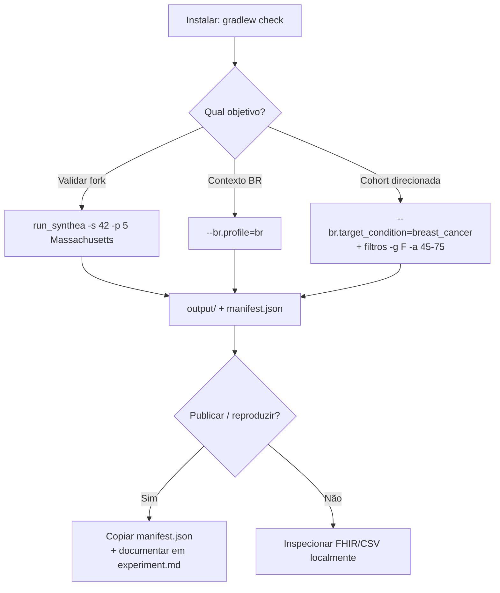

# Guia de Uso — Synthea-br

Guia didático em Português do Brasil para **usar** o fork acadêmico **Synthea-br** (PUCPR): instalar, gerar pacientes sintéticos, ativar o contexto brasileiro e produzir cohorts reprodutíveis para pesquisa.

> **Para quem é este guia?** Pesquisadores, estudantes e desenvolvedores que querem **rodar** o gerador — não apenas contribuir com código. Se você vai documentar experimentos ou citar o fork em artigos, complemente com [`CONTRIBUTING-ACADEMICO.md`](CONTRIBUTING-ACADEMICO.md).

---

## 1. O que é o Synthea-br?

O [Synthea](https://github.com/synthetichealth/synthea) upstream simula vidas inteiras de pacientes fictícios e exporta prontuários em FHIR, CSV, C-CDA etc. — com demografia e geografia **centradas nos EUA**.

O **Synthea-br** mantém o motor upstream e adiciona:

| Capacidade | Para quê serve |
|------------|----------------|
| **Perfil brasileiro** (`br.profile=br`) | Demografia IBGE, municípios BR, providers BR, codificação CID-10 piloto |
| **Condição clínica alvo** (`br.target_condition`) | Gerar cohort onde todos (ou quase todos) têm a condição desejada — MVP: câncer de mama |
| **Manifest de rastreabilidade** | Arquivo `output/manifest.json` com seed, hash de config, commit e checksum — reprodutibilidade acadêmica |

**Importante:** todos os dados são **100% sintéticos**. O fork **não** é validado para uso clínico real (diagnóstico, tratamento ou decisões assistenciais).

---

## 2. Pré-requisitos

| Requisito | Detalhe |
|-----------|---------|
| **Java (JDK)** | 17 ou superior (LTS recomendado: 17 ou 25) |
| **Git** | Para clonar o repositório |
| **Gradle** | Já incluído via wrapper (`gradlew` / `gradlew.bat`) — não precisa instalar |
| **Sistema operacional** | Windows, Linux ou macOS |

Verifique o Java:

```bash
java -version
```

Deve mostrar versão 17 ou superior.

---

## 3. Instalação

### 3.1 Clonar o repositório

```bash
git clone <URL-do-seu-fork-ou-repo>
cd synthea
```

### 3.2 Validar que tudo funciona

```bash
# Linux / macOS
./gradlew check

# Windows (PowerShell ou CMD)
gradlew.bat check
```

Este comando compila o projeto, roda testes, Checkstyle e JaCoCo. Espere alguns minutos na primeira execução (download de dependências).

Se `./gradlew check` passar, a instalação está OK.

---

## 4. Sua primeira geração (modo upstream / EUA)

O modo padrão reproduz o comportamento do Synthea original — útil para validar a instalação antes de ativar recursos BR.

```bash
# Linux / macOS — 5 pacientes em Massachusetts, seed fixa 42
./run_synthea -s 42 -p 5 Massachusetts

# Windows — equivalente
run_synthea.bat -s 42 -p 5 Massachusetts
```

### O que acontece?

1. O motor simula vidas completas (nascimento → envelhecimento → morte, conforme módulos clínicos).
2. Os arquivos exportados vão para a pasta **`output/`** (ignorada pelo Git).
3. Ao final, é escrito **`output/manifest.json`** com metadados de rastreabilidade.

### Ver a ajuda completa

```bash
./run_synthea -h
# ou: run_synthea.bat -h
```

Parâmetros mais usados:

| Parâmetro | Significado | Exemplo |
|-----------|-------------|---------|
| `-s` | Seed (reprodutibilidade) | `-s 42` |
| `-p` | Tamanho da população | `-p 100` |
| `-g` | Gênero (`M` ou `F`) | `-g F` |
| `-a` | Faixa etária | `-a 50-70` |
| `-c` | Arquivo de config alternativo | `-c meu.properties` |
| `--chave=valor` | Sobrescreve qualquer property | `--exporter.csv.export=true` |

---

## 5. Entendendo a saída

Após uma geração, explore `output/`:

```
output/
├── fhir/              # Bundles FHIR R4 (um arquivo .json por paciente, se habilitado)
├── manifest.json      # Rastreabilidade acadêmica (Synthea-br)
└── metadata/          # Metadados da execução (quando exporter.metadata.export=true)
```

### manifest.json

Exemplo de estrutura:

```json
{
  "seed": 42,
  "config_hash": "abc123...",
  "commit_sha": "0e32c32b...",
  "output_checksum": "def456...",
  "generated_at_iso8601": "2026-06-30T15:00:00Z"
}
```

| Campo | Uso |
|-------|-----|
| `seed` | Mesma seed + mesma config → mesma população |
| `config_hash` | Identifica a configuração exata usada |
| `commit_sha` | Versão do código no momento da geração |
| `output_checksum` | Hash dos arquivos exportados (reprodutibilidade) |

Para pesquisa acadêmica oficial do grupo, **preserve** este arquivo junto com o experimento. Desabilitar (não recomendado): `br.manifest.enabled = false` em `synthea.properties`.

---

## 6. Configuração: arquivo vs linha de comando

As opções padrão ficam em:

```
src/main/resources/synthea.properties
```

**Não edite esse arquivo diretamente** para experimentos pontuais — prefira:

1. **CLI** (rápido, reprodutível no comando):
   ```bash
   run_synthea.bat -s 42 -p 10 --br.profile=br --exporter.csv.export=true
   ```

2. **Cópia local** (`-c meu.properties`) para experimentos repetidos.

### Exportações comuns

Por padrão, só **FHIR R4** está ativo. Para ativar outros formatos:

```properties
exporter.fhir.export = true          # FHIR R4 (padrão: true)
exporter.csv.export = true           # CSV tabular
exporter.ccda.export = true          # C-CDA
exporter.fhir.bulk_data = true       # FHIR bulk (ndjson)
```

Via CLI:

```bash
run_synthea.bat -p 10 --exporter.csv.export=true
```

Saída em subpasta customizada:

```bash
run_synthea.bat -p 10 --exporter.baseDirectory=./output_experimento/
```

---

## 7. Modo brasileiro (`br.profile=br`)

Ative o perfil de localização brasileiro quando precisar de contexto BR em vez de defaults EUA.

```bash
run_synthea.bat -s 42 -p 100 --br.profile=br
```

### O que muda?

| Aspecto | Comportamento |
|---------|---------------|
| **Idade, sexo, raça/cor** | Distribuições nacionais IBGE (Censo 2022), não census US |
| **Município / UF / CEP** | Sorteio ponderado por população a partir do **subset piloto** (~25 municípios — capitais e cidades médias) |
| **Providers** | UBS e hospital genérico BR (CSV em `src/main/resources/br/providers/`) |
| **Codificação clínica** | Mapeamento SNOMED → CID-10 piloto (ex.: câncer de mama) nos exportadores FHIR |

### O que ainda **não** muda no MVP?

- **Etnia** (`hispanic`/`nonhispanic`), **idioma** e variáveis **socioeconômicas** (renda, educação) continuam calibradas como no upstream US até stories futuras.
- **Raça/cor nos exports FHIR** ainda usa categorias internas US Census — o IBGE é refletido nas **proporções**, não na taxonomia FHIR. Ver [ADR-003](research/adr/ADR-003-mapeamento-raca-cor-ibge.md).

### Municípios disponíveis (piloto)

Lista em `src/main/resources/br/geography/municipios_piloto.csv` — inclui São Paulo, Rio de Janeiro, Curitiba, Belo Horizonte, Salvador, Brasília, etc. **Não** cobre os 5.570 municípios do IBGE; expansão é iterativa pós-MVP.

Com `br.profile=br`, a geografia de cada paciente é sorteada entre esses municípios (ponderado por população), independentemente do estado/cidade passados na linha de comando no estilo upstream.

---

## 8. Cohort com condição garantida (`br.target_condition`)

Para gerar pacientes **com câncer de mama** (única condição suportada no MVP):

```bash
run_synthea.bat -s 42 -p 20 -g F -a 45-75 ^
  --br.profile=br ^
  --br.target_condition=breast_cancer
```

> No PowerShell, use `` ` `` no lugar de `^` para continuar linhas, ou escreva tudo em uma linha.

### Por que `-g F` e `-a 45-75`?

O módulo de gate de câncer de mama foi calibrado para um recorte demográfico (mulheres, faixa etária compatível). Sem filtro de gênero/idade, o motor pode precisar de **muitas tentativas** por paciente aceito — até atingir `generate.max_attempts_to_keep_patient`.

### Modos de gate

| Property | Valor | Comportamento |
|----------|-------|---------------|
| `br.target_condition.gate_mode` | `retry` (padrão) | Regenera até o paciente satisfazer a condição |
| `br.target_condition.gate_mode` | `exclude` | Gera uma vez; **não exporta** quem não satisfaz |

Exemplo com modo exclude:

```bash
run_synthea.bat -s 42 -p 50 -g F -a 45-75 ^
  --br.target_condition=breast_cancer ^
  --br.target_condition.gate_mode=exclude
```

### Condição inválida

Valores não suportados (ex.: `diabetes_tipo_x`) geram erro claro na inicialização — consulte `synthea.properties` para a lista atual.

---

## 9. Receitas prontas (copiar e colar)

### A — Validar instalação (EUA, 2 pacientes)

```bash
run_synthea.bat -s 42 -p 2 Massachusetts
```

### B — População brasileira genérica (100 pacientes)

```bash
run_synthea.bat -s 12345 -p 100 --br.profile=br
```

### C — Cohort BR de câncer de mama (20 pacientes, reprodutível)

```bash
run_synthea.bat -s 42 -p 20 -g F -a 45-75 --br.profile=br --br.target_condition=breast_cancer
```

### D — Export FHIR + CSV para análise tabular

```bash
run_synthea.bat -s 42 -p 50 --br.profile=br --exporter.csv.export=true --exporter.fhir.export=true
```

### E — Config em arquivo separado

1. Crie `experimento.properties` com:
   ```properties
   br.profile = br
   br.target_condition = breast_cancer
   exporter.fhir.export = true
   ```
2. Execute:
   ```bash
   run_synthea.bat -c experimento.properties -s 42 -p 30 -g F -a 45-75
   ```

---

## 10. Fluxo mental (diagrama)



---

## 11. Reprodutibilidade em 4 passos

1. **Fixe a seed** (`-s 42`).
2. **Registre o comando exato** (incluindo todos os `--flags`).
3. **Guarde `output/manifest.json`** — ele amarra seed, config e commit.
4. **Documente** seguindo o [template de experimento](research/experiments/experiment-template.md).

Outro pesquisador deve conseguir repetir o run e obter checksum equivalente (salvo diferenças de ambiente documentadas em `metadata/`).

---

## 12. Limitações conhecidas (MVP)

Leia como **escopo intencional**, não bugs ocultos:

- Geografia BR = **subset piloto**, não malha municipal completa.
- Condição alvo = **apenas câncer de mama**; múltiplas condições combinadas = pós-MVP.
- Plausibilidade clínica avançada e relatórios de validação = Epics futuras (4–5).
- Exports FHIR seguem perfis **US Core** upstream; extensões FHIR BR completas = roadmap.
- **Não** use em produção clínica ou conformidade regulatória (ANVISA/CFM).

Decisões de arquitetura detalhadas: [`docs/research/adr/README.md`](research/adr/README.md).

---

## 13. Solução de problemas

| Sintoma | Causa provável | O que fazer |
|---------|----------------|-------------|
| `java` não encontrado | JDK não instalado ou fora do PATH | Instalar JDK 17+ e reiniciar o terminal |
| `./gradlew check` falha | Dependência, teste ou Checkstyle | Ler a mensagem de erro; rodar `./gradlew test` para isolar |
| Geração muito lenta com `breast_cancer` | Filtros demográficos ausentes | Adicionar `-g F -a 45-75` (ou faixa documentada) |
| Pasta `output/` vazia | Export desabilitado | Verificar `exporter.fhir.export=true` (padrão) |
| Sem `manifest.json` | Flag desligada ou falha de escrita | Confirmar `br.manifest.enabled=true`; checar permissões em `output/` |
| Cidade US aparece com `br.profile=br` | Esperado no MVP para etnia/renda | Demografia IBGE cobre idade/sexo/raça; socioeconômico = deferido |

---

## 14. Onde ir a partir daqui

| Documento | Conteúdo |
|-----------|----------|
| [`CONTRIBUTING-ACADEMICO.md`](CONTRIBUTING-ACADEMICO.md) | Workflow de contribuição, citação em papers, disclaimer ético |
| [`research/adr/README.md`](research/adr/README.md) | Por que cada decisão técnica foi tomada |
| [`research/experiments/experiment-template.md`](research/experiments/experiment-template.md) | Template para documentar runs |
| [`../_bmad-output/planning-artifacts/prds/prd-synthea-2026-06-29/prd.md`](../_bmad-output/planning-artifacts/prds/prd-synthea-2026-06-29/prd.md) | Visão de produto e requisitos |
| [Wiki upstream Synthea](https://github.com/synthetichealth/synthea/wiki) | Módulos GMF, exportadores, conceitos do motor original |
| [`../README.md`](../README.md) | Quick start em inglês (foco upstream) |

---

## 15. Glossário rápido

| Termo | Significado |
|-------|-------------|
| **Seed** | Número que torna a geração determinística |
| **Cohort** | Conjunto de pacientes gerados numa execução |
| **GMF** | Generic Module Framework — módulos de doença em JSON |
| **FHIR** | Padrão HL7 de interoperabilidade em saúde |
| **Perfil `br`** | Flag mestre que liga localização brasileira |
| **Manifest** | Prova de reprodutibilidade (`manifest.json`) |

---

*Última atualização: 2026-06-30 — alinhado ao MVP (Epics 1–3 implementadas; Epics 4–5 em evolução).*
