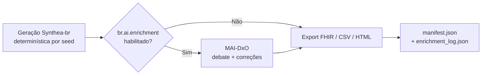

# Sumário Executivo — Sistema MAI-DxO (Synthea-br)

**Versão:** 1.0  
**Data:** 2026-07-08  
**Status:** Em produção no MVP (Epic 8)  
**Decisão arquitetural:** [ADR-007](research/adr/ADR-007-ai-enrichment-maidxo.md)

---

## Visão geral

O **MAI-DxO** (adaptação do modelo *Multi-Agent Intelligence for Diagnostic Orchestration*, Microsoft) é um estágio **opcional** de enriquecimento clínico por IA no pipeline do Synthea-br. Após a geração determinística de pacientes sintéticos, um painel de **personas clínicas** debate cada prontuário e propõe **correções estruturadas** antes do export (FHIR, CSV, HTML narrativo).

O objetivo é elevar **coerência clínica**, **credibilidade contextual** (Brasil/SUS) e **completude regional** dos dados sintéticos — sem substituir as regras determinísticas do Epic 4, mas complementando-as com raciocínio assistido por LLM.

---

## Problema que resolve

| Desafio | Como o MAI-DxO responde |
|---------|-------------------------|
| Lacunas de exames para a condição-alvo | Persona *Test-Chooser* identifica e propõe `add_observation` |
| Incoerência temporal (datas de atendimento) | Persona *Hypothesis* + `fix_encounter_date` |
| Dados regionais ausentes (município/UF) | Persona *Checklist* + `set_person_attribute` |
| Procedimentos inconsistentes com o caso | Debate entre personas + `add_procedure` ou `flag_unfixable` |
| Exames redundantes ou fora do contexto SUS | Persona *Stewardship* filtra propostas de baixo valor |

---

## Posicionamento no pipeline

- **Quando roda:** pós-geração, pré-export (`AiEnrichmentService.enrichCohort`).
- **Pré-requisito:** `br.profile=br`.
- **Ativação:** `br.ai.enrichment.enabled=true` (CLI ou Web UI).
- **Determinismo:** a seed governa apenas a geração inicial; a camada IA é declarada **não-determinística** (`deterministic=false` no log).

---

## Arquitetura do debate

### Personas (ordem fixa por iteração)

| Persona | Papel |
|---------|-------|
| **Dr. Hypothesis** | Hipóteses de incoerência clínica (sequência diagnóstico–tratamento, lacunas temporais) |
| **Dr. Test-Chooser** | Exames faltantes ou inconsistentes para a condição |
| **Dr. Stewardship** | Adequação ao contexto SUS/Brasil e custo-benefício |
| **Dr. Checklist** | Completude, formato das correções e coerência regional (IBGE/município) |
| **Dr. Challenger** | Contesta correções prematuras; finaliza o caso quando adequado |

### Gatekeeper

Componente que **detém o prontuário completo** (`HealthRecord`) e responde **somente** a consultas explícitas das personas (`AskQuestion`, `RequestRecordSlice`). Simula a dinâmica clínica de solicitar informação sob demanda, evitando dump integral do registro no contexto do LLM.

### Ciclo por paciente

1. Resumo inicial do caso + índice de atendimentos.
2. Até `br.ai.max_iterations` rodadas (padrão: 5).
3. Em cada rodada, as 5 personas respondem em JSON estruturado.
4. Operações aprovadas são aplicadas via `CorrectionApplicator` (whitelist).
5. Resultado auditado em `PatientEnrichmentResult` + resumo narrativo PT-BR para HTML.

---

## Operações de correção (v1)

| Operação | Efeito |
|----------|--------|
| `add_observation` | Adiciona exame/observação ao prontuário |
| `fix_encounter_date` | Corrige data de um atendimento |
| `set_person_attribute` | Ajusta atributo do paciente (ex.: dados regionais) |
| `add_procedure` | Adiciona procedimento |
| `flag_unfixable` | Sinaliza limitação não corrigível (com `reason` obrigatório) |

Toda mutação pós-geração passa exclusivamente pelo `CorrectionApplicator` — exceção documentada à regra AD-2 (export não muta `HealthRecord`).

---

## Provedores de LLM suportados

| Provedor | Uso típico | Credencial (BYOK) |
|----------|------------|-------------------|
| `openai` | Uso geral; padrão `gpt-4o-mini` | Chave OpenAI (`sk-...`) |
| `gemini` | Alternativa Google; padrão `gemini-2.5-flash` | Chave Gemini (AI Studio) |
| `medgemma` | Domínio médico; via Hugging Face | Token HF (`hf_...`) |

Catálogo centralizado em `AiModelCatalog.java`. Chaves **nunca** são persistidas em disco, log ou manifest — limpas ao final de cada execução.

---

## Saídas e auditoria

| Artefato | Conteúdo |
|----------|----------|
| `output/br/ai/enrichment_log.json` | Metadados do run, debate por paciente, correções aplicadas, flags, resumos narrativos |
| `manifest.json` → `ai_enrichment` | Metadados resumidos da execução |
| `output/html/index.html` | Seção **"Dados enriquecidos por IA"** com resumo cohort e por paciente |

---

## O que o sistema analisa — e o que não analisa

### Analisa (dados estruturados)

- Coerência clínica do `HealthRecord` (condições, exames, procedimentos, medicamentos, datas).
- Lacunas de exames relevantes para a condição-alvo.
- Dados demográficos e regionais (idade, sexo, município/UF) via Gatekeeper.
- Adequação ao contexto brasileiro/SUS (orientação das personas).

### Não analisa (limitação atual)

- **Narrativa HTML** gerada pelo `HtmlExporter` — o MAI-DxO não lê nem valida o texto narrativo exportado.
- **Credibilidade narrativa em prosa** — o `AiNarrativeSummarizer` apenas *descreve* correções já aplicadas; não há loop de validação narrativa → orquestrador.
- **Reprodutibilidade da camada IA** — mesma seed pode produzir correções diferentes entre execuções.

---

## Parâmetros principais

| Parâmetro | Padrão | Função |
|-----------|--------|--------|
| `br.ai.enrichment.enabled` | `false` | Liga/desliga o pipeline |
| `br.ai.provider` | `openai` | Provedor LLM |
| `br.ai.model` | `gpt-4o-mini` | Modelo (validado contra catálogo) |
| `br.ai.max_patients` | `10` | Teto de pacientes enriquecidos por run |
| `br.ai.max_iterations` | `5` | Rodadas de debate por paciente |
| `br.ai.temperature` | `0.2` | Temperatura do LLM |
| `br.ai.timeout_seconds` | `120` | Timeout HTTP por chamada |

---

## Riscos e mitigações

| Risco | Mitigação |
|-------|-----------|
| Alucinação clínica | Whitelist de operações; Challenger + Checklist; Gatekeeper com consultas pontuais |
| Custo e latência | Cap de pacientes; modelos econômicos como padrão; BYOK |
| Vazamento de API key | Chave em memória transitória; `clearApiKey()` em `finally` |
| Perda de reprodutibilidade | Documentada; seed governa só geração; log marca `deterministic=false` |
| Correções inválidas | `CorrectionApplicator` valida schema; ops não suportadas são ignoradas |

---

## Quando usar

**Recomendado** para cohorts piloto de pesquisa (ex.: `breast_cancer`), demonstrações de plausibilidade clínica regional e validação qualitativa de prontuários sintéticos.

**Evitar** quando reprodutibilidade total é requisito de publicação sem documentar a não-determinística da camada IA, ou para populações grandes sem orçamento de API (usar regras do Epic 4).

---

## Interfaces de acesso

- **CLI:** flags `--br.ai.*` (ver [GUIA-DE-USO.md §10.1](GUIA-DE-USO.md#101-enriquecimento-por-ia-epic-8)).
- **Web UI:** formulário em `localhost` com seleção de provedor/modelo e campo BYOK.
- **Código:** pacote `org.mitre.synthea.br.ai` (`MaiDxoOrchestrator`, `AiEnrichmentService`, `Gatekeeper`, `CorrectionApplicator`).

---

## Evolução prevista

- Expandir operações de correção após validação com cohort piloto.
- Persona revisor de narrativa (validação HTML vs. prontuário estruturado).
- Modo sidecar sem mutação para publicações que exijam reprodutibilidade total.
- Integração com providers adicionais conforme catálogo `AiModelCatalog`.

---

## Referências

- [ADR-007 — Enriquecimento Clínico por IA (MAI-DxO)](research/adr/ADR-007-ai-enrichment-maidxo.md)
- [GUIA-DE-USO.md §10.1 — Enriquecimento por IA](GUIA-DE-USO.md#101-enriquecimento-por-ia-epic-8)
- [ADR-001 — Spike IA vs Regras](research/adr/ADR-001-spike-ia-vs-regras.md)
- Código: `src/main/java/org/mitre/synthea/br/ai/`
- Prompts: `src/main/resources/br/ai/prompts/`
