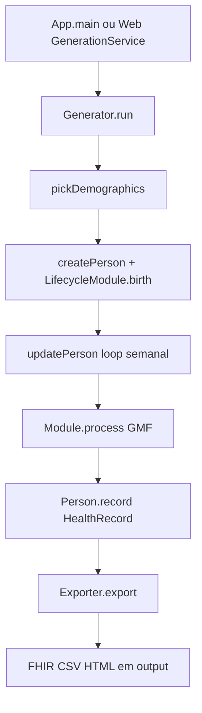

# Mapa do motor de geração — Synthea-br

Guia de navegação para estudantes e programadores: **onde** e **como** os dados clínicos sintéticos nascem no repositório — e **onde alterar** o projeto sem se perder.

> Relatório executivo visual: [`mapa-motor-geracao.html`](mapa-motor-geracao.html) (abra no browser).  
> Para *usar* o gerador (comandos, flags, receitas), veja o [`GUIA-DE-USO.md`](GUIA-DE-USO.md).

---

## Veredito em uma frase

Pacientes sintéticos são simulados pelo `Generator` (loop semanal GMF → `HealthRecord`); o fork BR envolve demografia/geografia/providers e filtra trajetórias — **sem substituir** o motor upstream.

---

## 1. Árvore anotada do repositório

| Pasta / arquivo | Papel na geração |
|-----------------|------------------|
| `src/main/java/App.java` | Entry CLI; `--web` sobe a UI BR |
| `src/main/java/org/mitre/synthea/engine/` | Motor: `Generator`, `Module`, `State` |
| `src/main/java/org/mitre/synthea/modules/` | Módulos Java core (Lifecycle, Encounter, Death, …) |
| `src/main/java/org/mitre/synthea/world/` | `Person`, `HealthRecord`, geografia, providers, payers |
| `src/main/java/org/mitre/synthea/export/` | Materializa FHIR, CSV, HTML, … |
| `src/main/java/org/mitre/synthea/br/` | Extensões Brasil (demografia, gate, pathway, web, IA) |
| `src/main/resources/modules/` | Módulos GMF JSON (clínica) |
| `src/main/resources/br/` | Dados e config BR (demographics, geography, pathways, web) |
| `src/main/resources/synthea.properties` | Config padrão (geração + export + flags `br.*`) |
| `docs/` | Documentação humana (este mapa, GUIA, ADRs) |
| `_bmad-output/` | Planejamento BMAD — **não** roda na JVM de geração |
| `output/` | Saídas de uma execução (FHIR, HTML, manifest, …) |
| `config/simulations/` | Fisiologia (fora do fluxo normal de pacientes) |

---

## 2. Pipeline ponta a ponta

### Momento → classe → resource → o que escreve

| Momento | Classe (path) | Resource / config | O que produz |
|---------|---------------|-------------------|--------------|
| Entry | `App.java` ou `br/web/GenerationService.java` | args CLI / `GenerationRequest` | `GeneratorOptions` + `Config` |
| Orquestração | `engine/Generator.java` | `generate.*`, filtros `-m` / BR | Pool de pacientes; chama create/update/export |
| Demografia | `Generator` + `br/demographics/*` (se `br.profile=br`) | `br/demographics/*.csv`, geography | Atributos: idade, sexo, raça/IBGE, município |
| Nascimento | `modules/LifecycleModule` | — | `Person` viva + atributos iniciais |
| Loop temporal | `Generator.updatePerson` | `generate.timestep` (padrão 1 semana) | Avança o tempo até `stop` ou morte |
| Clínica GMF | `engine/Module.java` + `State.java` | `resources/modules/**/*.json` | Conditions, procedures, meds, observations no record |
| Encounters / seguro | `EncounterModule`, `HealthInsuranceModule` | payers/providers | Encontros e cobertura |
| Prontuário | `world/concepts/HealthRecord.java` | — | Modelo interno (ainda não é FHIR) |
| Critérios / gate | `br/condition/TargetConditionIntegration` | `br.target_condition`, keep modules | Aceita ou rejeita o paciente |
| Export | `export/Exporter.java` (+ `HtmlExporter`, FHIR, …) | `exporter.*`, `br.pathway.focus` | Arquivos em `output/` |
| Pós-cohort | plausibilidade, manifest, IA opcional | `br.plausibility.*`, `br.manifest.*`, `br.ai.*` | Relatórios / enriquecimento |

Timestep padrão: `generate.timestep = 604800000` ms (1 semana).

---

## 3. Classes âncora

| Componente | Path |
|------------|------|
| CLI | [`src/main/java/App.java`](../src/main/java/App.java) |
| Generator | [`src/main/java/org/mitre/synthea/engine/Generator.java`](../src/main/java/org/mitre/synthea/engine/Generator.java) |
| Module (GMF) | [`src/main/java/org/mitre/synthea/engine/Module.java`](../src/main/java/org/mitre/synthea/engine/Module.java) |
| State | [`src/main/java/org/mitre/synthea/engine/State.java`](../src/main/java/org/mitre/synthea/engine/State.java) |
| Person | [`src/main/java/org/mitre/synthea/world/agents/Person.java`](../src/main/java/org/mitre/synthea/world/agents/Person.java) |
| HealthRecord | [`src/main/java/org/mitre/synthea/world/concepts/HealthRecord.java`](../src/main/java/org/mitre/synthea/world/concepts/HealthRecord.java) |
| Exporter | [`src/main/java/org/mitre/synthea/export/Exporter.java`](../src/main/java/org/mitre/synthea/export/Exporter.java) |
| Web → Generator | [`src/main/java/org/mitre/synthea/br/web/GenerationService.java`](../src/main/java/org/mitre/synthea/br/web/GenerationService.java) |
| Config | [`src/main/java/org/mitre/synthea/helpers/Config.java`](../src/main/java/org/mitre/synthea/helpers/Config.java) |

Métodos-chave do `Generator`: `run()`, `generatePerson()`, `createPerson()`, `updatePerson()`, `pickDemographics()` / `randomDemographics()`, `getModulePredicate()`.

---

## 4. Onde alterar o quê

| Quero mudar… | Onde olhar primeiro |
|--------------|---------------------|
| Doença / trajetória clínica | `src/main/resources/modules/**/*.json` (+ subpastas, ex. `modules/breast_cancer/`) |
| Demografia / UF / raça BR | `src/main/resources/br/demographics/`, `br/geography/` + loaders em `org.mitre.synthea.br.demographics` / `br.geography` |
| Providers BR | `src/main/resources/br/providers/` + `br/providers/BrProviderLoader.java` |
| Filtro de módulos (allowlist) | `br/pathway/generation/ModuleProfileConfig.java` + `resources/br/generation/module_profiles/` |
| Modo de trajetória | `br/pathway/TrajectoryModeConfig.java` (`lifespan` vs `episodic`) |
| Janela de simulação | `br/pathway/generation/SimulationWindowConfig.java` |
| Gate de condição | `br.target_condition` + `br/condition/TargetConditionIntegration.java` + keep modules |
| Foco no export (pathway) | `br/pathway/PathwayExportFilter.java` + `br.pathway.focus` |
| Formato de saída | flags `exporter.*.export` em `synthea.properties` + classes em `export/` |
| HTML narrativo | `export/HtmlExporter.java` + `br/pathway/PathwayHtmlModelBuilder.java` |
| UI de geração | `src/main/resources/br/web/` + `br/web/*` |
| Config global | `synthea.properties` / CLI `-c` / `--chave=valor` |

---

## 5. Walkthrough: câncer de mama + perfil BR

Caminho típico de arquivos numa geração acadêmica focada:

1. **Entry** — `./run_synthea ...` (`App.main`) ou `./gradlew runWeb` → `GenerationService`
2. **Perfil BR** — `br.profile=br` ativa demografia IBGE, geografia e `BrProviderLoader` em vez do pack EUA
3. **Cohort / gate** — `br.target_condition=breast_cancer` (e keep modules) filtra quem entra no cohort
4. **Módulo clínico** — `src/main/resources/modules/breast_cancer.json` + submódulos em `modules/breast_cancer/` (staging, surgery, …)
5. **Perfil de módulos** — opcional `br.generation.module_profile=pathway_minimal` restringe quais GMF rodam
6. **Simulação** — `Generator.updatePerson` processa estados GMF e grava em `Person.record` (`HealthRecord`)
7. **Export** — `Exporter.export` → FHIR/CSV/HTML; `PathwayExportFilter` pode estreitar o que sai; HTML pathway via `PathwayHtmlModelBuilder`
8. **Pós** — `manifest.json`, `plausibility_report.json`; IA (`br.ai.*`) só se habilitada — **depois** da simulação

---

## 6. Extensões Brasil (`org.mitre.synthea.br`) — o que não é o motor

Ativadas principalmente com `br.profile=br` (`BrProfile.isActive()`).

| Área | Efeito na geração |
|------|-------------------|
| Demografia / geografia / providers | Localiza quem nasce e onde é atendido |
| Gate + module profile + trajectory | Controla *quem* e *quais módulos* entram no cohort |
| Pathway export / HTML | Molda a *saída* e a narrativa; o prontuário simulado pode permanecer mais completo |
| Plausibilidade / manifest | Pós-geração (qualidade e reprodutibilidade) |
| IA (`br.ai.*`) | Enrichment opcional — não substitui GMF |
| Web UI | Mesmo `Generator` do CLI, outra fachada |

Recursos: `src/main/resources/br/` (demographics, geography, providers, pathways, terminology, generation, plausibility, web, AI prompts).

---

## 7. Fronteiras — não confundir

| Isto… | …não é |
|-------|--------|
| `config/simulations/` | Fluxo normal de geração de pacientes |
| Enrichment IA (`br.ai.*`) | Motor clínico GMF |
| Filtro `PathwayExportFilter` | Correção do prontuário na origem |
| `_bmad-output/` | Código ou dados de runtime |
| `docs/` | Execução — só documentação |
| Web UI | Motor diferente do CLI (é a mesma JVM/`Generator`) |

---

## 8. Config que controla a geração

| Mecanismo | Uso |
|-----------|-----|
| `src/main/resources/synthea.properties` | Defaults |
| CLI `-c path` | Carrega outro arquivo via `Config.load` |
| CLI `--chave=valor` | Override pontual |
| Web `GenerationRequest` | Aplica flags via `GenerationService` → mesmo `Config` |

Chaves úteis (upstream): `generate.default_population`, `generate.timestep`, `generate.thread_pool_size`, `export.baseDirectory`, `exporter.fhir.export`, `exporter.html.export`, `export.csv.export`.

Chaves BR: `br.profile`, `br.target_condition`, `br.generation.module_profile`, `br.generation.trajectory_mode`, `br.generation.simulation_window`, `br.pathway.focus`, `br.pathway.archetype`, `br.web.port`, `br.plausibility.report.enabled`, `br.manifest.enabled`, `br.ai.*`.

---

## 9. Links de continuidade

| Documento | Quando usar |
|-----------|-------------|
| [`GUIA-DE-USO.md`](GUIA-DE-USO.md) | Rodar gerações, flags, receitas |
| [`FONTES-CONTEXTO-BR.md`](FONTES-CONTEXTO-BR.md) | Proveniência dos dados BR |
| [`research/adr/ADR-008-trajetoria-clinica-focada.md`](research/adr/ADR-008-trajetoria-clinica-focada.md) | Decisões C/D/E de trajetória |
| [`CONTRIBUTING-ACADEMICO.md`](CONTRIBUTING-ACADEMICO.md) | Workflow de contribuição |
| [Architecture Spine](../_bmad-output/planning-artifacts/architecture/architecture-synthea-2026-06-30/ARCHITECTURE-SPINE.md) | Invariantes de arquitetura do produto |
| [Wiki GMF (upstream)](https://github.com/synthetichealth/synthea/wiki/Generic-Module-Framework) | Detalhe de estados/transições JSON |

---

## Glossário mínimo

| Termo | Significado |
|-------|-------------|
| **GMF** | Generic Module Framework — módulos de doença em JSON |
| **HealthRecord** | Prontuário interno na `Person` antes do export |
| **Timestep** | Incremento do loop de simulação (padrão: 1 semana) |
| **Gate** | Critério que aceita/rejeita paciente para o cohort |
| **Module profile** | Allowlist de módulos GMF (`full` vs `pathway_minimal`) |
| **Pathway focus** | Filtro de *export* por fases da trajetória |
